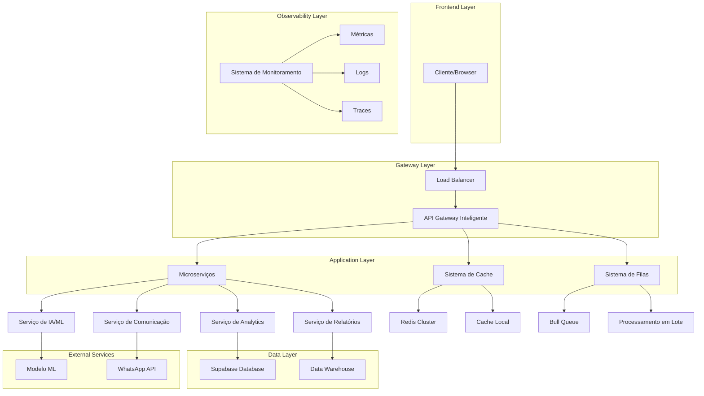
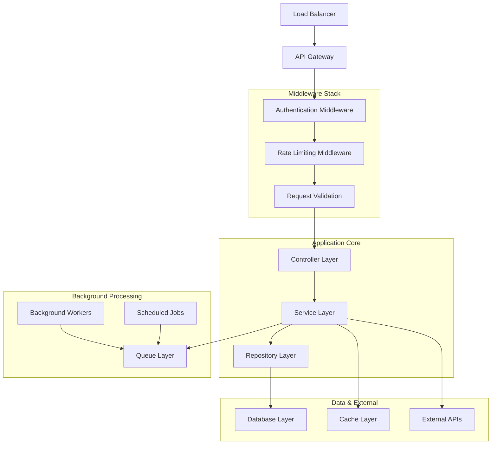
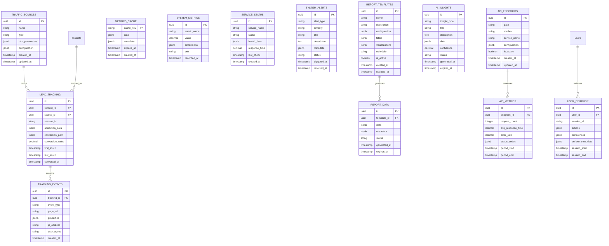

# Arquitetura Técnica para Implementação das Melhorias

## 1. Arquitetura Geral do Sistema



## 2. Stack Tecnológico

### 2.1 Frontend
- **Framework**: React 18 com TypeScript
- **Build Tool**: Vite
- **Styling**: TailwindCSS + Styled Components
- **State Management**: Zustand + React Query
- **UI Components**: Radix UI + Custom Components
- **Charts**: Recharts + D3.js
- **Real-time**: Socket.io Client

### 2.2 Backend/Middleware
- **Runtime**: Node.js 20+
- **Framework**: Express.js com TypeScript
- **API Gateway**: Custom com Express
- **Cache**: Redis 7+ (Cluster mode)
- **Queue**: Bull Queue com Redis
- **WebSockets**: Socket.io
- **Process Manager**: PM2

### 2.3 Database e Storage
- **Primary Database**: Supabase (PostgreSQL 15+)
- **Cache Database**: Redis 7+
- **File Storage**: Supabase Storage
- **Data Warehouse**: Supabase + Views Materializadas
- **Search Engine**: PostgreSQL Full-Text Search

### 2.4 AI/ML
- **ML Framework**: TensorFlow.js
- **NLP**: OpenAI API + Custom Models
- **Analytics**: Custom algorithms + Statistical models
- **Recommendation Engine**: Collaborative Filtering + Content-based

### 2.5 DevOps e Infraestrutura
- **Containerization**: Docker + Docker Compose
- **Orchestration**: Kubernetes (opcional)
- **CI/CD**: GitHub Actions
- **Monitoring**: Prometheus + Grafana
- **Logging**: Winston + ELK Stack
- **Tracing**: OpenTelemetry

## 3. Definições de Rotas

### 3.1 Frontend Routes

| Rota | Propósito | Componente Principal |
|------|-----------|---------------------|
| `/dashboard` | Dashboard principal com métricas em tempo real | `DashboardPage` |
| `/conversations` | Gestão de conversas com IA | `ConversationsPage` |
| `/contacts` | Gestão de contatos com segmentação inteligente | `ContactsPage` |
| `/campaigns` | Criação e gestão de campanhas com otimização IA | `CampaignsPage` |
| `/reports` | Relatórios avançados com BI | `ReportsPage` |
| `/analytics` | Analytics avançados com ML | `AnalyticsPage` |
| `/automation` | Automação inteligente de fluxos | `AutomationPage` |
| `/chatbots` | Gestão de chatbots com NLP | `ChatbotsPage` |
| `/tracking` | Tracking de leads com UTMs | `TrackingPage` |
| `/settings` | Configurações avançadas | `SettingsPage` |
| `/admin` | Painel administrativo | `AdminPage` |

### 3.2 API Routes

#### 3.2.1 Core APIs

**Analytics e Métricas**
```
GET /api/v2/analytics/dashboard
GET /api/v2/analytics/performance
GET /api/v2/analytics/cohorts
POST /api/v2/analytics/custom-query
```

**Tracking e UTMs**
```
GET /api/v2/tracking/sources
POST /api/v2/tracking/events
GET /api/v2/tracking/conversions
GET /api/v2/tracking/attribution
```

**Relatórios Avançados**
```
GET /api/v2/reports/templates
POST /api/v2/reports/generate
GET /api/v2/reports/scheduled
POST /api/v2/reports/export
```

**Sistema de IA**
```
POST /api/v2/ai/recommendations
POST /api/v2/ai/sentiment-analysis
POST /api/v2/ai/churn-prediction
POST /api/v2/ai/optimization
```

#### 3.2.2 Parâmetros de Request/Response

**Analytics Dashboard**
```typescript
// GET /api/v2/analytics/dashboard
interface DashboardRequest {
  timeRange: {
    start: string; // ISO date
    end: string;   // ISO date
  };
  metrics?: string[]; // ['revenue', 'conversions', 'engagement']
  segments?: string[]; // ['source', 'campaign', 'device']
}

interface DashboardResponse {
  metrics: {
    revenue: MetricData;
    conversions: MetricData;
    engagement: MetricData;
    [key: string]: MetricData;
  };
  trends: TrendData[];
  insights: AIInsight[];
  alerts: Alert[];
}

interface MetricData {
  current: number;
  previous: number;
  change: number;
  changePercent: number;
  trend: 'up' | 'down' | 'stable';
  forecast?: number;
}
```

**Tracking Events**
```typescript
// POST /api/v2/tracking/events
interface TrackingEventRequest {
  eventType: 'page_view' | 'click' | 'conversion' | 'custom';
  userId?: string;
  sessionId: string;
  properties: {
    page?: string;
    source?: string;
    medium?: string;
    campaign?: string;
    content?: string;
    term?: string;
    [key: string]: any;
  };
  timestamp?: string;
}

interface TrackingEventResponse {
  eventId: string;
  processed: boolean;
  attribution?: {
    firstTouch: AttributionData;
    lastTouch: AttributionData;
    multiTouch: AttributionData[];
  };
}
```

**AI Recommendations**
```typescript
// POST /api/v2/ai/recommendations
interface RecommendationRequest {
  type: 'campaign' | 'audience' | 'content' | 'timing';
  context: {
    campaignId?: string;
    audienceId?: string;
    historicalData?: any;
  };
  options?: {
    maxRecommendations?: number;
    confidenceThreshold?: number;
  };
}

interface RecommendationResponse {
  recommendations: {
    id: string;
    type: string;
    title: string;
    description: string;
    confidence: number;
    expectedImpact: {
      metric: string;
      improvement: number;
      confidence: number;
    };
    implementation: {
      difficulty: 'easy' | 'medium' | 'hard';
      estimatedTime: string;
      steps: string[];
    };
  }[];
  metadata: {
    modelVersion: string;
    processedAt: string;
    dataQuality: number;
  };
}
```

## 4. Arquitetura do Servidor



## 5. Modelo de Dados Avançado

### 5.1 Diagrama ER das Novas Tabelas



### 5.2 DDL para Novas Tabelas

```sql
-- Tabelas para Sistema de Tracking
CREATE TABLE traffic_sources (
    id UUID PRIMARY KEY DEFAULT gen_random_uuid(),
    name VARCHAR(255) NOT NULL,
    type VARCHAR(50) NOT NULL CHECK (type IN ('organic', 'paid', 'social', 'email', 'direct', 'referral')),
    utm_parameters JSONB DEFAULT '{}',
    configuration JSONB DEFAULT '{}',
    created_at TIMESTAMP WITH TIME ZONE DEFAULT NOW(),
    updated_at TIMESTAMP WITH TIME ZONE DEFAULT NOW()
);

CREATE TABLE lead_tracking (
    id UUID PRIMARY KEY DEFAULT gen_random_uuid(),
    contact_id UUID REFERENCES contacts(id) ON DELETE CASCADE,
    source_id UUID REFERENCES traffic_sources(id),
    session_id VARCHAR(255) NOT NULL,
    attribution_data JSONB DEFAULT '{}',
    conversion_path JSONB DEFAULT '[]',
    conversion_value DECIMAL(10,2) DEFAULT 0,
    first_touch TIMESTAMP WITH TIME ZONE,
    last_touch TIMESTAMP WITH TIME ZONE,
    converted_at TIMESTAMP WITH TIME ZONE,
    created_at TIMESTAMP WITH TIME ZONE DEFAULT NOW(),
    updated_at TIMESTAMP WITH TIME ZONE DEFAULT NOW()
);

CREATE TABLE tracking_events (
    id UUID PRIMARY KEY DEFAULT gen_random_uuid(),
    tracking_id UUID REFERENCES lead_tracking(id) ON DELETE CASCADE,
    event_type VARCHAR(50) NOT NULL,
    page_url TEXT,
    properties JSONB DEFAULT '{}',
    ip_address INET,
    user_agent TEXT,
    created_at TIMESTAMP WITH TIME ZONE DEFAULT NOW()
);

-- Tabelas para Sistema de Relatórios
CREATE TABLE report_templates (
    id UUID PRIMARY KEY DEFAULT gen_random_uuid(),
    name VARCHAR(255) NOT NULL,
    description TEXT,
    configuration JSONB NOT NULL,
    filters JSONB DEFAULT '{}',
    visualizations JSONB DEFAULT '[]',
    schedule VARCHAR(50),
    is_active BOOLEAN DEFAULT true,
    created_at TIMESTAMP WITH TIME ZONE DEFAULT NOW(),
    updated_at TIMESTAMP WITH TIME ZONE DEFAULT NOW()
);

CREATE TABLE report_data (
    id UUID PRIMARY KEY DEFAULT gen_random_uuid(),
    template_id UUID REFERENCES report_templates(id) ON DELETE CASCADE,
    data JSONB NOT NULL,
    metadata JSONB DEFAULT '{}',
    status VARCHAR(20) DEFAULT 'generated' CHECK (status IN ('generating', 'generated', 'failed', 'expired')),
    generated_at TIMESTAMP WITH TIME ZONE DEFAULT NOW(),
    expires_at TIMESTAMP WITH TIME ZONE
);

CREATE TABLE metrics_cache (
    cache_key VARCHAR(255) PRIMARY KEY,
    data JSONB NOT NULL,
    metadata JSONB DEFAULT '{}',
    expires_at TIMESTAMP WITH TIME ZONE NOT NULL,
    created_at TIMESTAMP WITH TIME ZONE DEFAULT NOW()
);

-- Tabelas para Sistema de Monitoramento
CREATE TABLE system_metrics (
    id UUID PRIMARY KEY DEFAULT gen_random_uuid(),
    metric_name VARCHAR(100) NOT NULL,
    value DECIMAL(15,4) NOT NULL,
    dimensions JSONB DEFAULT '{}',
    unit VARCHAR(20) DEFAULT 'count',
    recorded_at TIMESTAMP WITH TIME ZONE DEFAULT NOW()
);

CREATE TABLE service_status (
    id UUID PRIMARY KEY DEFAULT gen_random_uuid(),
    service_name VARCHAR(100) NOT NULL,
    status VARCHAR(20) NOT NULL CHECK (status IN ('healthy', 'degraded', 'unhealthy', 'unknown')),
    health_data JSONB DEFAULT '{}',
    response_time DECIMAL(8,2),
    last_check TIMESTAMP WITH TIME ZONE DEFAULT NOW(),
    created_at TIMESTAMP WITH TIME ZONE DEFAULT NOW()
);

CREATE TABLE system_alerts (
    id UUID PRIMARY KEY DEFAULT gen_random_uuid(),
    alert_type VARCHAR(50) NOT NULL,
    severity VARCHAR(20) NOT NULL CHECK (severity IN ('low', 'medium', 'high', 'critical')),
    title VARCHAR(255) NOT NULL,
    description TEXT,
    metadata JSONB DEFAULT '{}',
    status VARCHAR(20) DEFAULT 'active' CHECK (status IN ('active', 'acknowledged', 'resolved')),
    triggered_at TIMESTAMP WITH TIME ZONE DEFAULT NOW(),
    resolved_at TIMESTAMP WITH TIME ZONE
);

-- Tabelas para Performance de APIs
CREATE TABLE api_endpoints (
    id UUID PRIMARY KEY DEFAULT gen_random_uuid(),
    path VARCHAR(255) NOT NULL,
    method VARCHAR(10) NOT NULL,
    service_name VARCHAR(100) NOT NULL,
    configuration JSONB DEFAULT '{}',
    is_active BOOLEAN DEFAULT true,
    created_at TIMESTAMP WITH TIME ZONE DEFAULT NOW(),
    updated_at TIMESTAMP WITH TIME ZONE DEFAULT NOW()
);

CREATE TABLE api_metrics (
    id UUID PRIMARY KEY DEFAULT gen_random_uuid(),
    endpoint_id UUID REFERENCES api_endpoints(id) ON DELETE CASCADE,
    request_count INTEGER DEFAULT 0,
    avg_response_time DECIMAL(8,2) DEFAULT 0,
    error_rate DECIMAL(5,4) DEFAULT 0,
    status_codes JSONB DEFAULT '{}',
    period_start TIMESTAMP WITH TIME ZONE NOT NULL,
    period_end TIMESTAMP WITH TIME ZONE NOT NULL
);

-- Tabelas para IA e Comportamento
CREATE TABLE user_behavior (
    id UUID PRIMARY KEY DEFAULT gen_random_uuid(),
    user_id UUID REFERENCES users(id) ON DELETE CASCADE,
    session_id VARCHAR(255) NOT NULL,
    actions JSONB DEFAULT '[]',
    preferences JSONB DEFAULT '{}',
    performance_data JSONB DEFAULT '{}',
    session_start TIMESTAMP WITH TIME ZONE DEFAULT NOW(),
    session_end TIMESTAMP WITH TIME ZONE
);

CREATE TABLE ai_insights (
    id UUID PRIMARY KEY DEFAULT gen_random_uuid(),
    insight_type VARCHAR(50) NOT NULL,
    title VARCHAR(255) NOT NULL,
    description TEXT,
    data JSONB DEFAULT '{}',
    confidence DECIMAL(3,2) CHECK (confidence >= 0 AND confidence <= 1),
    status VARCHAR(20) DEFAULT 'active' CHECK (status IN ('active', 'dismissed', 'implemented')),
    generated_at TIMESTAMP WITH TIME ZONE DEFAULT NOW(),
    expires_at TIMESTAMP WITH TIME ZONE
);

-- Índices para Performance
CREATE INDEX idx_lead_tracking_contact_id ON lead_tracking(contact_id);
CREATE INDEX idx_lead_tracking_source_id ON lead_tracking(source_id);
CREATE INDEX idx_lead_tracking_session_id ON lead_tracking(session_id);
CREATE INDEX idx_lead_tracking_converted_at ON lead_tracking(converted_at DESC);

CREATE INDEX idx_tracking_events_tracking_id ON tracking_events(tracking_id);
CREATE INDEX idx_tracking_events_event_type ON tracking_events(event_type);
CREATE INDEX idx_tracking_events_created_at ON tracking_events(created_at DESC);

CREATE INDEX idx_report_data_template_id ON report_data(template_id);
CREATE INDEX idx_report_data_generated_at ON report_data(generated_at DESC);
CREATE INDEX idx_report_data_status ON report_data(status);

CREATE INDEX idx_metrics_cache_expires_at ON metrics_cache(expires_at);

CREATE INDEX idx_system_metrics_metric_name ON system_metrics(metric_name);
CREATE INDEX idx_system_metrics_recorded_at ON system_metrics(recorded_at DESC);

CREATE INDEX idx_service_status_service_name ON service_status(service_name);
CREATE INDEX idx_service_status_last_check ON service_status(last_check DESC);

CREATE INDEX idx_system_alerts_severity ON system_alerts(severity);
CREATE INDEX idx_system_alerts_status ON system_alerts(status);
CREATE INDEX idx_system_alerts_triggered_at ON system_alerts(triggered_at DESC);

CREATE INDEX idx_api_metrics_endpoint_id ON api_metrics(endpoint_id);
CREATE INDEX idx_api_metrics_period_start ON api_metrics(period_start DESC);

CREATE INDEX idx_user_behavior_user_id ON user_behavior(user_id);
CREATE INDEX idx_user_behavior_session_start ON user_behavior(session_start DESC);

CREATE INDEX idx_ai_insights_insight_type ON ai_insights(insight_type);
CREATE INDEX idx_ai_insights_generated_at ON ai_insights(generated_at DESC);
CREATE INDEX idx_ai_insights_status ON ai_insights(status);

-- Views Materializadas para Performance
CREATE MATERIALIZED VIEW mv_daily_metrics AS
SELECT 
    DATE(recorded_at) as date,
    metric_name,
    AVG(value) as avg_value,
    MIN(value) as min_value,
    MAX(value) as max_value,
    COUNT(*) as sample_count
FROM system_metrics 
GROUP BY DATE(recorded_at), metric_name;

CREATE UNIQUE INDEX idx_mv_daily_metrics ON mv_daily_metrics(date, metric_name);

CREATE MATERIALIZED VIEW mv_conversion_funnel AS
SELECT 
    ts.name as source_name,
    ts.type as source_type,
    COUNT(DISTINCT lt.id) as total_leads,
    COUNT(DISTINCT CASE WHEN lt.converted_at IS NOT NULL THEN lt.id END) as conversions,
    ROUND(
        COUNT(DISTINCT CASE WHEN lt.converted_at IS NOT NULL THEN lt.id END)::DECIMAL / 
        NULLIF(COUNT(DISTINCT lt.id), 0) * 100, 2
    ) as conversion_rate,
    SUM(COALESCE(lt.conversion_value, 0)) as total_value
FROM traffic_sources ts
LEFT JOIN lead_tracking lt ON ts.id = lt.source_id
GROUP BY ts.id, ts.name, ts.type;

CREATE UNIQUE INDEX idx_mv_conversion_funnel ON mv_conversion_funnel(source_name);

-- Triggers para atualização automática
CREATE OR REPLACE FUNCTION update_updated_at_column()
RETURNS TRIGGER AS $$
BEGIN
    NEW.updated_at = NOW();
    RETURN NEW;
END;
$$ language 'plpgsql';

CREATE TRIGGER update_traffic_sources_updated_at BEFORE UPDATE ON traffic_sources FOR EACH ROW EXECUTE FUNCTION update_updated_at_column();
CREATE TRIGGER update_lead_tracking_updated_at BEFORE UPDATE ON lead_tracking FOR EACH ROW EXECUTE FUNCTION update_updated_at_column();
CREATE TRIGGER update_report_templates_updated_at BEFORE UPDATE ON report_templates FOR EACH ROW EXECUTE FUNCTION update_updated_at_column();
CREATE TRIGGER update_api_endpoints_updated_at BEFORE UPDATE ON api_endpoints FOR EACH ROW EXECUTE FUNCTION update_updated_at_column();

-- Políticas RLS (Row Level Security)
ALTER TABLE traffic_sources ENABLE ROW LEVEL SECURITY;
ALTER TABLE lead_tracking ENABLE ROW LEVEL SECURITY;
ALTER TABLE tracking_events ENABLE ROW LEVEL SECURITY;
ALTER TABLE report_templates ENABLE ROW LEVEL SECURITY;
ALTER TABLE report_data ENABLE ROW LEVEL SECURITY;
ALTER TABLE user_behavior ENABLE ROW LEVEL SECURITY;
ALTER TABLE ai_insights ENABLE ROW LEVEL SECURITY;

-- Políticas básicas (ajustar conforme necessário)
CREATE POLICY "Users can view their own tracking data" ON lead_tracking FOR SELECT USING (auth.uid()::text = (SELECT user_id::text FROM contacts WHERE id = contact_id));
CREATE POLICY "Users can view their own behavior data" ON user_behavior FOR SELECT USING (auth.uid() = user_id);

-- Grants para roles
GRANT SELECT ON traffic_sources TO anon, authenticated;
GRANT ALL ON traffic_sources TO authenticated;

GRANT SELECT ON lead_tracking TO anon, authenticated;
GRANT ALL ON lead_tracking TO authenticated;

GRANT SELECT ON tracking_events TO anon, authenticated;
GRANT ALL ON tracking_events TO authenticated;

GRANT SELECT ON report_templates TO anon, authenticated;
GRANT ALL ON report_templates TO authenticated;

GRANT SELECT ON report_data TO anon, authenticated;
GRANT ALL ON report_data TO authenticated;

GRANT SELECT ON metrics_cache TO anon, authenticated;
GRANT ALL ON metrics_cache TO authenticated;

GRANT SELECT ON system_metrics TO authenticated;
GRANT INSERT ON system_metrics TO authenticated;

GRANT SELECT ON service_status TO authenticated;
GRANT ALL ON service_status TO authenticated;

GRANT SELECT ON system_alerts TO authenticated;
GRANT ALL ON system_alerts TO authenticated;

GRANT SELECT ON api_endpoints TO authenticated;
GRANT ALL ON api_endpoints TO authenticated;

GRANT SELECT ON api_metrics TO authenticated;
GRANT ALL ON api_metrics TO authenticated;

GRANT SELECT ON user_behavior TO authenticated;
GRANT ALL ON user_behavior TO authenticated;

GRANT SELECT ON ai_insights TO authenticated;
GRANT ALL ON ai_insights TO authenticated;

-- Grants para views materializadas
GRANT SELECT ON mv_daily_metrics TO anon, authenticated;
GRANT SELECT ON mv_conversion_funnel TO anon, authenticated;
```

## 6. Hooks TypeScript para Supabase

### 6.1 Hooks para Sistema de Tracking

```typescript
// useTrackingMetrics.ts
export const useTrackingMetrics = (timeRange: DateRange) => {
  return useEnhancedSupabaseQuery({
    queryKey: ['tracking-metrics', timeRange],
    queryFn: async () => {
      const { data, error } = await supabase
        .from('mv_conversion_funnel')
        .select('*')
        .order('total_value', { ascending: false });
      
      if (error) throw error;
      return data;
    },
    staleTime: 5 * 60 * 1000, // 5 minutos
  });
};

// useTrafficSources.ts
export const useTrafficSources = () => {
  return useEnhancedSupabaseQuery({
    queryKey: ['traffic-sources'],
    queryFn: async () => {
      const { data, error } = await supabase
        .from('traffic_sources')
        .select('*')
        .eq('is_active', true)
        .order('created_at', { ascending: false });
      
      if (error) throw error;
      return data;
    },
  });
};

// useTrackingEvents.ts
export const useTrackingEvents = (trackingId: string) => {
  return useEnhancedSupabaseQuery({
    queryKey: ['tracking-events', trackingId],
    queryFn: async () => {
      const { data, error } = await supabase
        .from('tracking_events')
        .select('*')
        .eq('tracking_id', trackingId)
        .order('created_at', { ascending: false });
      
      if (error) throw error;
      return data;
    },
  });
};
```

### 6.2 Hooks para Sistema de Relatórios

```typescript
// useReportTemplates.ts
export const useReportTemplates = () => {
  return useEnhancedSupabaseQuery({
    queryKey: ['report-templates'],
    queryFn: async () => {
      const { data, error } = await supabase
        .from('report_templates')
        .select('*')
        .eq('is_active', true)
        .order('name');
      
      if (error) throw error;
      return data;
    },
  });
};

// useGenerateReport.ts
export const useGenerateReport = () => {
  return useEnhancedSupabaseMutation({
    mutationFn: async ({ templateId, filters }: { templateId: string; filters?: any }) => {
      const { data, error } = await supabase
        .from('report_data')
        .insert({
          template_id: templateId,
          data: {},
          metadata: { filters },
          status: 'generating'
        })
        .select()
        .single();
      
      if (error) throw error;
      
      // Trigger background job para gerar relatório
      await fetch('/api/v2/reports/generate', {
        method: 'POST',
        headers: { 'Content-Type': 'application/json' },
        body: JSON.stringify({ reportId: data.id, templateId, filters })
      });
      
      return data;
    },
  });
};

// useMetricsCache.ts
export const useMetricsCache = (cacheKey: string) => {
  return useEnhancedSupabaseQuery({
    queryKey: ['metrics-cache', cacheKey],
    queryFn: async () => {
      const { data, error } = await supabase
        .from('metrics_cache')
        .select('*')
        .eq('cache_key', cacheKey)
        .gt('expires_at', new Date().toISOString())
        .single();
      
      if (error && error.code !== 'PGRST116') throw error;
      return data;
    },
    staleTime: 60 * 1000, // 1 minuto
  });
};
```

### 6.3 Hooks para Sistema de Monitoramento

```typescript
// useSystemMetrics.ts
export const useSystemMetrics = (metricName: string, timeRange: DateRange) => {
  return useEnhancedSupabaseQuery({
    queryKey: ['system-metrics', metricName, timeRange],
    queryFn: async () => {
      const { data, error } = await supabase
        .from('system_metrics')
        .select('*')
        .eq('metric_name', metricName)
        .gte('recorded_at', timeRange.start)
        .lte('recorded_at', timeRange.end)
        .order('recorded_at', { ascending: false });
      
      if (error) throw error;
      return data;
    },
    refetchInterval: 30000, // 30 segundos
  });
};

// useServiceStatus.ts
export const useServiceStatus = () => {
  return useEnhancedSupabaseQuery({
    queryKey: ['service-status'],
    queryFn: async () => {
      const { data, error } = await supabase
        .from('service_status')
        .select('*')
        .order('last_check', { ascending: false });
      
      if (error) throw error;
      return data;
    },
    refetchInterval: 15000, // 15 segundos
  });
};

// useSystemAlerts.ts
export const useSystemAlerts = (status?: string) => {
  return useEnhancedSupabaseQuery({
    queryKey: ['system-alerts', status],
    queryFn: async () => {
      let query = supabase
        .from('system_alerts')
        .select('*');
      
      if (status) {
        query = query.eq('status', status);
      }
      
      const { data, error } = await query
        .order('triggered_at', { ascending: false })
        .limit(100);
      
      if (error) throw error;
      return data;
    },
    refetchInterval: 10000, // 10 segundos
  });
};
```

## 7. Estratégias de Performance

### 7.1 Otimização de Queries
- **Índices Compostos**: Para queries complexas com múltiplos filtros
- **Views Materializadas**: Para agregações pesadas e relatórios
- **Particionamento**: Para tabelas com grande volume de dados
- **Query Planning**: Análise e otimização de planos de execução

### 7.2 Sistema de Cache
- **L1 Cache**: Memória local da aplicação (Map/LRU)
- **L2 Cache**: Redis distribuído
- **L3 Cache**: Banco de dados (views materializadas)
- **Cache Warming**: Pré-carregamento de dados frequentes

### 7.3 Lazy Loading e Virtualização
- **React.lazy()**: Carregamento sob demanda de componentes
- **React Window**: Virtualização de listas grandes
- **Intersection Observer**: Carregamento baseado em visibilidade
- **Progressive Loading**: Carregamento incremental de dados

## 8. Segurança e Compliance

### 8.1 Row Level Security (RLS)
- Políticas baseadas em usuário autenticado
- Isolamento de dados por organização
- Controle granular de acesso

### 8.2 Validação com Zod
```typescript
// Schemas de validação
export const TrackingEventSchema = z.object({
  eventType: z.enum(['page_view', 'click', 'conversion', 'custom']),
  userId: z.string().uuid().optional(),
  sessionId: z.string().min(1),
  properties: z.record(z.any()),
  timestamp: z.string().datetime().optional(),
});

export const ReportConfigSchema = z.object({
  name: z.string().min(1).max(255),
  description: z.string().optional(),
  configuration: z.object({
    metrics: z.array(z.string()),
    dimensions: z.array(z.string()),
    filters: z.record(z.any()),
  }),
  schedule: z.enum(['hourly', 'daily', 'weekly', 'monthly']).optional(),
});
```

### 8.3 Auditoria e Logs
- Log estruturado com Winston
- Rastreamento de ações do usuário
- Compliance com LGPD/GDPR
- Retenção automática de dados

## 9. Monitoramento e Observabilidade

### 9.1 Métricas de Aplicação
- **Golden Signals**: Latência, Tráfego, Erros, Saturação
- **Business Metrics**: Conversões, Revenue, Engagement
- **Custom Metrics**: Específicas do domínio

### 9.2 Health Checks
```typescript
// Health check endpoint
app.get('/health', async (req, res) => {
  const checks = await Promise.allSettled([
    checkDatabase(),
    checkRedis(),
    checkExternalAPIs(),
    checkDiskSpace(),
    checkMemoryUsage(),
  ]);
  
  const health = {
    status: checks.every(check => check.status === 'fulfilled') ? 'healthy' : 'unhealthy',
    timestamp: new Date().toISOString(),
    checks: checks.map((check, index) => ({
      name: ['database', 'redis', 'external_apis', 'disk', 'memory'][index],
      status: check.status === 'fulfilled' ? 'pass' : 'fail',
      details: check.status === 'fulfilled' ? check.value : check.reason,
    })),
  };
  
  res.status(health.status === 'healthy' ? 200 : 503).json(health);
});
```

## 10. Plano de Implementação

### 10.1 Fase 1: Infraestrutura Base (Semana 1-2)
1. Criação das novas tabelas no Supabase
2. Implementação dos hooks TypeScript
3. Setup do sistema de cache Redis
4. Configuração do sistema de filas

### 10.2 Fase 2: Sistema de Tracking (Semana 3-4)
1. Implementação do tracking de eventos
2. Sistema de atribuição de leads
3. Dashboard de tracking em tempo real
4. Integração com UTM parameters

### 10.3 Fase 3: Sistema de Relatórios (Semana 5-6)
1. Engine de geração de relatórios
2. Templates configuráveis
3. Agendamento automático
4. Exportação em múltiplos formatos

### 10.4 Fase 4: Otimização e Monitoramento (Semana 7-8)
1. Implementação do sistema de cache multinível
2. Otimização de performance
3. Sistema de monitoramento completo
4. Alertas inteligentes

Esta arquitetura técnica fornece a base sólida para implementar todas as melhorias propostas, garantindo escalabilidade, performance e manutenibilidade de classe mundial.