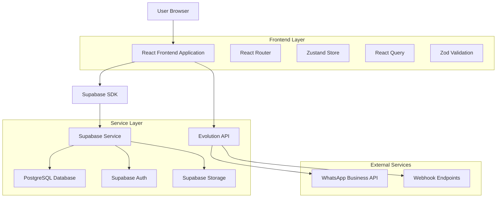
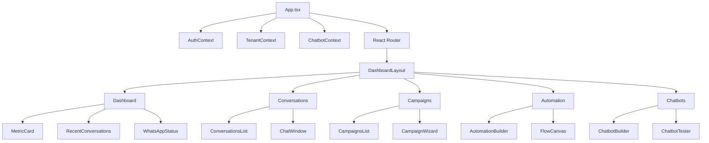
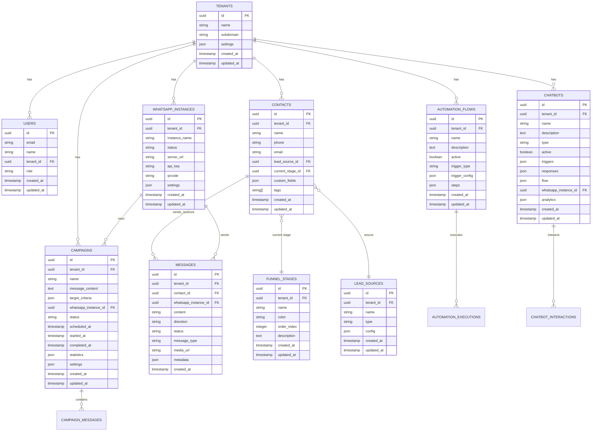

# Arquitetura Técnica - ConvoFlow

## 1. Arquitetura Geral



## 2. Descrição das Tecnologias

- **Frontend**: React@18 + TypeScript + Tailwind CSS + Vite
- **Backend**: Supabase (PostgreSQL + Auth + Storage)
- **Estado**: Zustand + React Query
- **Validação**: Zod
- **UI Components**: Shadcn/ui + Radix UI
- **Integração WhatsApp**: Evolution API
- **Charts**: Recharts
- **Ícones**: Lucide React

## 3. Definições de Rotas

| Rota | Propósito |
|------|----------|
| / | Página inicial, redireciona para dashboard |
| /login | Página de autenticação |
| /dashboard | Dashboard principal com métricas |
| /conversations | Gestão de conversas do WhatsApp |
| /chatbots | Configuração e gestão de chatbots |
| /campaigns | Criação e gestão de campanhas |
| /automation | Builder de automação e workflows |
| /contacts | Gestão de contatos e leads |
| /funnel | Configuração do funil de vendas |
| /analytics | Relatórios e analytics avançados |
| /settings | Configurações do sistema |
| /integrations | Gestão de integrações externas |

## 4. Definições de API (Supabase)

### 4.1 Core API - Autenticação

**Supabase Auth Integration**
```typescript
// Login
supabase.auth.signInWithPassword({
  email: string,
  password: string
})

// Register
supabase.auth.signUp({
  email: string,
  password: string,
  options: {
    data: {
      name: string,
      tenant_id: string
    }
  }
})

// Logout
supabase.auth.signOut()
```

### 4.2 Core API - Dados

**Contacts API**
```typescript
// GET /contacts
interface ContactsResponse {
  id: string;
  name: string;
  phone: string;
  email?: string;
  lead_source_id?: string;
  current_stage_id?: string;
  tags?: string[];
  created_at: string;
  updated_at: string;
}

// POST /contacts
interface CreateContactRequest {
  name: string;
  phone: string;
  email?: string;
  lead_source_id?: string;
  current_stage_id?: string;
  tags?: string[];
}
```

**Messages API**
```typescript
// GET /messages
interface MessagesResponse {
  id: string;
  content: string;
  contact_id: string;
  direction: 'inbound' | 'outbound';
  status: 'sent' | 'delivered' | 'read' | 'failed';
  message_type: 'text' | 'image' | 'audio' | 'video' | 'document';
  media_url?: string;
  created_at: string;
}

// POST /messages
interface SendMessageRequest {
  contact_id: string;
  content: string;
  message_type: 'text' | 'image' | 'audio' | 'video' | 'document';
  media_url?: string;
}
```

**Campaigns API**
```typescript
// GET /campaigns
interface CampaignsResponse {
  id: string;
  name: string;
  message_content: string;
  target_criteria: object;
  status: 'draft' | 'scheduled' | 'active' | 'completed' | 'paused';
  scheduled_at?: string;
  statistics: {
    total_targets: number;
    sent_count: number;
    delivered_count: number;
    read_count: number;
    failed_count: number;
  };
  created_at: string;
}

// POST /campaigns
interface CreateCampaignRequest {
  name: string;
  message_content: string;
  target_criteria: object;
  whatsapp_instance_id: string;
  scheduled_at?: string;
}
```

**Automation Flows API**
```typescript
// GET /automation_flows
interface AutomationFlowsResponse {
  id: string;
  name: string;
  description: string;
  active: boolean;
  trigger_type: string;
  trigger_config: object;
  steps: object[];
  created_at: string;
}

// POST /automation_flows
interface CreateAutomationFlowRequest {
  name: string;
  description: string;
  trigger_type: string;
  trigger_config: object;
  steps: object[];
}
```

### 4.3 Evolution API Integration

**Instance Management**
```typescript
// Create Instance
POST /instance/create
{
  instanceName: string;
  token?: string;
  qrcode?: boolean;
  webhook?: string;
}

// Get Instance Info
GET /instance/fetchInstances

// Connect Instance
POST /instance/connect/{instanceName}

// Disconnect Instance
DELETE /instance/logout/{instanceName}
```

**Message Operations**
```typescript
// Send Text Message
POST /message/sendText/{instanceName}
{
  number: string;
  text: string;
}

// Send Media Message
POST /message/sendMedia/{instanceName}
{
  number: string;
  mediatype: 'image' | 'video' | 'audio' | 'document';
  media: string; // URL or base64
  caption?: string;
}

// Send Contact
POST /message/sendContact/{instanceName}
{
  number: string;
  contact: {
    fullName: string;
    wuid: string;
    phoneNumber: string;
  }
}
```

## 5. Arquitetura de Componentes



## 6. Modelo de Dados

### 6.1 Diagrama ER



### 6.2 DDL (Data Definition Language)

**Tabela Users**
```sql
CREATE TABLE users (
    id UUID PRIMARY KEY DEFAULT gen_random_uuid(),
    email VARCHAR(255) UNIQUE NOT NULL,
    name VARCHAR(100) NOT NULL,
    tenant_id UUID REFERENCES tenants(id) ON DELETE CASCADE,
    role VARCHAR(20) DEFAULT 'user' CHECK (role IN ('admin', 'user', 'viewer')),
    created_at TIMESTAMP WITH TIME ZONE DEFAULT NOW(),
    updated_at TIMESTAMP WITH TIME ZONE DEFAULT NOW()
);

CREATE INDEX idx_users_tenant_id ON users(tenant_id);
CREATE INDEX idx_users_email ON users(email);

-- RLS Policies
ALTER TABLE users ENABLE ROW LEVEL SECURITY;
CREATE POLICY "Users can view own tenant users" ON users
    FOR SELECT USING (tenant_id = (SELECT tenant_id FROM users WHERE id = auth.uid()));
```

**Tabela Contacts**
```sql
CREATE TABLE contacts (
    id UUID PRIMARY KEY DEFAULT gen_random_uuid(),
    tenant_id UUID REFERENCES tenants(id) ON DELETE CASCADE NOT NULL,
    name VARCHAR(100) NOT NULL,
    phone VARCHAR(20) NOT NULL,
    email VARCHAR(255),
    lead_source_id UUID REFERENCES lead_sources(id),
    current_stage_id UUID REFERENCES funnel_stages(id),
    custom_fields JSONB DEFAULT '{}',
    tags TEXT[] DEFAULT '{}',
    created_at TIMESTAMP WITH TIME ZONE DEFAULT NOW(),
    updated_at TIMESTAMP WITH TIME ZONE DEFAULT NOW(),
    UNIQUE(tenant_id, phone)
);

CREATE INDEX idx_contacts_tenant_id ON contacts(tenant_id);
CREATE INDEX idx_contacts_phone ON contacts(phone);
CREATE INDEX idx_contacts_stage ON contacts(current_stage_id);
CREATE INDEX idx_contacts_source ON contacts(lead_source_id);
CREATE INDEX idx_contacts_tags ON contacts USING GIN(tags);

-- RLS Policies
ALTER TABLE contacts ENABLE ROW LEVEL SECURITY;
CREATE POLICY "Contacts are viewable by tenant" ON contacts
    FOR ALL USING (tenant_id = (SELECT tenant_id FROM users WHERE id = auth.uid()));
```

**Tabela Messages**
```sql
CREATE TABLE messages (
    id UUID PRIMARY KEY DEFAULT gen_random_uuid(),
    tenant_id UUID REFERENCES tenants(id) ON DELETE CASCADE NOT NULL,
    contact_id UUID REFERENCES contacts(id) ON DELETE CASCADE NOT NULL,
    whatsapp_instance_id UUID REFERENCES whatsapp_instances(id),
    content TEXT NOT NULL,
    direction VARCHAR(10) CHECK (direction IN ('inbound', 'outbound')) NOT NULL,
    status VARCHAR(20) DEFAULT 'sent' CHECK (status IN ('sent', 'delivered', 'read', 'failed')),
    message_type VARCHAR(20) DEFAULT 'text' CHECK (message_type IN ('text', 'image', 'audio', 'video', 'document', 'location', 'contact')),
    media_url TEXT,
    metadata JSONB DEFAULT '{}',
    created_at TIMESTAMP WITH TIME ZONE DEFAULT NOW()
);

CREATE INDEX idx_messages_tenant_id ON messages(tenant_id);
CREATE INDEX idx_messages_contact_id ON messages(contact_id);
CREATE INDEX idx_messages_created_at ON messages(created_at DESC);
CREATE INDEX idx_messages_direction ON messages(direction);
CREATE INDEX idx_messages_status ON messages(status);

-- RLS Policies
ALTER TABLE messages ENABLE ROW LEVEL SECURITY;
CREATE POLICY "Messages are viewable by tenant" ON messages
    FOR ALL USING (tenant_id = (SELECT tenant_id FROM users WHERE id = auth.uid()));
```

**Tabela Campaigns**
```sql
CREATE TABLE campaigns (
    id UUID PRIMARY KEY DEFAULT gen_random_uuid(),
    tenant_id UUID REFERENCES tenants(id) ON DELETE CASCADE NOT NULL,
    name VARCHAR(100) NOT NULL,
    message_content TEXT NOT NULL,
    target_criteria JSONB NOT NULL DEFAULT '{}',
    whatsapp_instance_id UUID REFERENCES whatsapp_instances(id) NOT NULL,
    status VARCHAR(20) DEFAULT 'draft' CHECK (status IN ('draft', 'scheduled', 'active', 'completed', 'paused', 'cancelled')),
    scheduled_at TIMESTAMP WITH TIME ZONE,
    started_at TIMESTAMP WITH TIME ZONE,
    completed_at TIMESTAMP WITH TIME ZONE,
    statistics JSONB DEFAULT '{
        "total_targets": 0,
        "sent_count": 0,
        "delivered_count": 0,
        "read_count": 0,
        "failed_count": 0,
        "response_count": 0
    }',
    settings JSONB DEFAULT '{
        "send_interval_seconds": 5,
        "max_daily_sends": 1000,
        "retry_failed": true,
        "max_retries": 3
    }',
    created_at TIMESTAMP WITH TIME ZONE DEFAULT NOW(),
    updated_at TIMESTAMP WITH TIME ZONE DEFAULT NOW()
);

CREATE INDEX idx_campaigns_tenant_id ON campaigns(tenant_id);
CREATE INDEX idx_campaigns_status ON campaigns(status);
CREATE INDEX idx_campaigns_scheduled_at ON campaigns(scheduled_at);
CREATE INDEX idx_campaigns_instance_id ON campaigns(whatsapp_instance_id);

-- RLS Policies
ALTER TABLE campaigns ENABLE ROW LEVEL SECURITY;
CREATE POLICY "Campaigns are viewable by tenant" ON campaigns
    FOR ALL USING (tenant_id = (SELECT tenant_id FROM users WHERE id = auth.uid()));
```

**Tabela Automation Flows**
```sql
CREATE TABLE automation_flows (
    id UUID PRIMARY KEY DEFAULT gen_random_uuid(),
    tenant_id UUID REFERENCES tenants(id) ON DELETE CASCADE NOT NULL,
    name VARCHAR(100) NOT NULL,
    description TEXT,
    active BOOLEAN DEFAULT false,
    trigger_type VARCHAR(50) NOT NULL,
    trigger_config JSONB NOT NULL DEFAULT '{}',
    steps JSONB NOT NULL DEFAULT '[]',
    created_at TIMESTAMP WITH TIME ZONE DEFAULT NOW(),
    updated_at TIMESTAMP WITH TIME ZONE DEFAULT NOW()
);

CREATE INDEX idx_automation_flows_tenant_id ON automation_flows(tenant_id);
CREATE INDEX idx_automation_flows_active ON automation_flows(active);
CREATE INDEX idx_automation_flows_trigger_type ON automation_flows(trigger_type);

-- RLS Policies
ALTER TABLE automation_flows ENABLE ROW LEVEL SECURITY;
CREATE POLICY "Automation flows are viewable by tenant" ON automation_flows
    FOR ALL USING (tenant_id = (SELECT tenant_id FROM users WHERE id = auth.uid()));
```

**Tabela WhatsApp Instances**
```sql
CREATE TABLE whatsapp_instances (
    id UUID PRIMARY KEY DEFAULT gen_random_uuid(),
    tenant_id UUID REFERENCES tenants(id) ON DELETE CASCADE NOT NULL,
    instance_name VARCHAR(100) NOT NULL,
    status VARCHAR(20) DEFAULT 'disconnected' CHECK (status IN ('open', 'close', 'connecting', 'qrcode', 'disconnected')),
    server_url TEXT NOT NULL,
    api_key TEXT NOT NULL,
    qrcode TEXT,
    webhook_url TEXT,
    settings JSONB DEFAULT '{
        "rejectCall": false,
        "msgCall": "Não atendemos chamadas",
        "groupsIgnore": true,
        "alwaysOnline": true,
        "readMessages": true,
        "readStatus": true
    }',
    created_at TIMESTAMP WITH TIME ZONE DEFAULT NOW(),
    updated_at TIMESTAMP WITH TIME ZONE DEFAULT NOW(),
    UNIQUE(tenant_id, instance_name)
);

CREATE INDEX idx_whatsapp_instances_tenant_id ON whatsapp_instances(tenant_id);
CREATE INDEX idx_whatsapp_instances_status ON whatsapp_instances(status);

-- RLS Policies
ALTER TABLE whatsapp_instances ENABLE ROW LEVEL SECURITY;
CREATE POLICY "WhatsApp instances are viewable by tenant" ON whatsapp_instances
    FOR ALL USING (tenant_id = (SELECT tenant_id FROM users WHERE id = auth.uid()));
```

## 7. Hooks e Utilitários Customizados

### 7.1 useSupabaseQuery
```typescript
interface UseSupabaseQueryOptions {
  table: string;
  select?: string;
  filters?: QueryFilter[];
  orderBy?: OrderBy[];
  limit?: number;
  offset?: number;
  enabled?: boolean;
  queryKey: string[];
}

export function useSupabaseQuery(options: UseSupabaseQueryOptions) {
  // Implementação com React Query + Supabase
  // Inclui filtros automáticos de tenant_id
  // Tratamento de erros padronizado
  // Cache inteligente
}
```

### 7.2 useEnhancedSupabaseMutation
```typescript
interface UseEnhancedSupabaseMutationOptions {
  table: string;
  operation: 'insert' | 'update' | 'delete' | 'upsert';
  inputSchema?: z.ZodSchema;
  outputSchema?: z.ZodSchema;
  enableLogging?: boolean;
  enableToast?: boolean;
  retryCount?: number;
  customErrorHandler?: (error: SupabaseError) => boolean;
}

export function useEnhancedSupabaseMutation(options: UseEnhancedSupabaseMutationOptions) {
  // Implementação com validação Zod
  // Retry automático
  // Logging estruturado
  // Tratamento de erros categorizado
  // Invalidação de cache automática
}
```

### 7.3 Logger Utility
```typescript
interface LogEntry {
  level: 'debug' | 'info' | 'warn' | 'error';
  category: 'auth' | 'api' | 'ui' | 'database' | 'performance' | 'security';
  message: string;
  context?: Record<string, any>;
  error?: Error;
}

class EnhancedSecureLogger {
  // Sanitização de dados sensíveis
  // Batching de logs
  // Envio para serviços externos
  // Métricas de performance
}
```

## 8. Segurança e Permissões

### 8.1 Row Level Security (RLS)
```sql
-- Política padrão para multi-tenancy
CREATE POLICY "tenant_isolation" ON {table_name}
    FOR ALL USING (
        tenant_id = (
            SELECT tenant_id 
            FROM users 
            WHERE id = auth.uid()
        )
    );

-- Política para administradores
CREATE POLICY "admin_access" ON {table_name}
    FOR ALL USING (
        EXISTS (
            SELECT 1 FROM users 
            WHERE id = auth.uid() 
            AND role = 'admin'
        )
    );
```

### 8.2 Validação de Dados
```typescript
// Schemas Zod para validação
export const ContactSchema = z.object({
  name: z.string().min(1).max(100),
  phone: z.string().regex(/^\+?[1-9]\d{1,14}$/),
  email: z.string().email().optional(),
  // ... outros campos
});

// Sanitização automática
export function sanitizeInput(data: any): any {
  // Remove scripts, SQL injection, etc.
}
```

## 9. Performance e Otimização

### 9.1 Estratégias de Cache
```typescript
// React Query com cache inteligente
const queryClient = new QueryClient({
  defaultOptions: {
    queries: {
      staleTime: 5 * 60 * 1000, // 5 minutos
      cacheTime: 10 * 60 * 1000, // 10 minutos
      retry: 2,
      refetchOnWindowFocus: false,
    },
  },
});

// Cache de assets estáticos
// Service Worker para cache offline
// Invalidação inteligente de cache
```

### 9.2 Otimizações de Banco
```sql
-- Índices estratégicos
CREATE INDEX CONCURRENTLY idx_messages_contact_created 
    ON messages(contact_id, created_at DESC);

-- Particionamento por tenant
CREATE TABLE messages_partition_tenant_1 
    PARTITION OF messages 
    FOR VALUES IN ('tenant-uuid-1');

-- Materialized views para analytics
CREATE MATERIALIZED VIEW daily_message_stats AS
SELECT 
    tenant_id,
    DATE(created_at) as date,
    COUNT(*) as total_messages,
    COUNT(*) FILTER (WHERE direction = 'outbound') as sent_messages,
    COUNT(*) FILTER (WHERE direction = 'inbound') as received_messages
FROM messages
GROUP BY tenant_id, DATE(created_at);
```

## 10. Monitoramento e Observabilidade

### 10.1 Métricas de Aplicação
```typescript
// Performance metrics
interface PerformanceMetrics {
  responseTime: number;
  errorRate: number;
  throughput: number;
  userSatisfaction: number;
}

// Health checks
interface HealthCheck {
  database: 'healthy' | 'degraded' | 'down';
  evolutionApi: 'healthy' | 'degraded' | 'down';
  supabase: 'healthy' | 'degraded' | 'down';
}
```

### 10.2 Alertas e Notificações
```typescript
// Sistema de alertas
interface Alert {
  type: 'warning' | 'error' | 'critical';
  message: string;
  threshold: number;
  currentValue: number;
  actions: string[];
}
```

Esta arquitetura técnica fornece uma base sólida para o desenvolvimento e manutenção do ConvoFlow, garantindo escalabilidade, segurança e performance adequadas para uma aplicação de gestão de WhatsApp Business de nível empresarial.