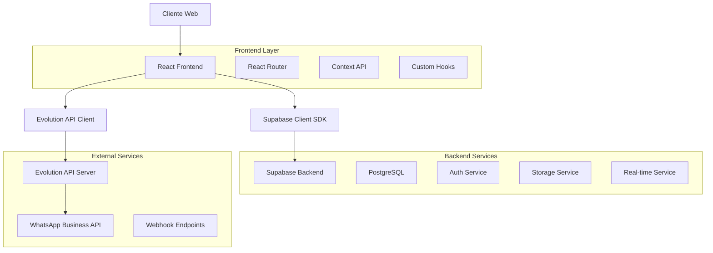
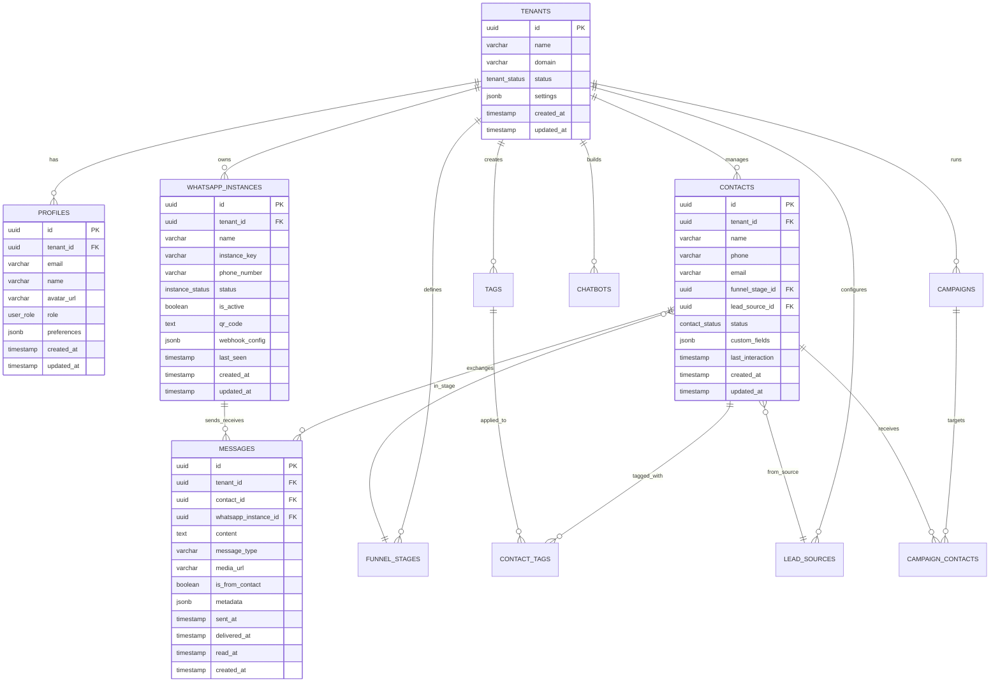

# Especificações Técnicas - ConvoFlow

## 1. Arquitetura do Sistema

### 1.1 Diagrama de Arquitetura



### 1.2 Stack Tecnológico Detalhado

**Frontend:**
- React 18.2.0 + TypeScript 5.0+
- Vite 4.0+ (Build Tool)
- Tailwind CSS 3.3+ (Styling)
- shadcn/ui (Component Library)
- React Router 6.8+ (Routing)
- React Hook Form 7.43+ (Forms)
- Zod 3.20+ (Validation)
- Sonner (Notifications)
- Lucide React (Icons)
- Date-fns (Date Utilities)

**Backend:**
- Supabase (BaaS)
- PostgreSQL 15+ (Database)
- PostgREST (Auto API)
- GoTrue (Authentication)
- Realtime (WebSocket)
- Storage (File Management)

**Integrações:**
- Evolution API (WhatsApp)
- Webhooks (Event Handling)

## 2. Estrutura de Dados

### 2.1 Modelo de Dados Principal



### 2.2 Enums e Tipos

```sql
-- User Roles
CREATE TYPE user_role AS ENUM (
    'super_admin',
    'tenant_admin', 
    'user'
);

-- Tenant Status
CREATE TYPE tenant_status AS ENUM (
    'active',
    'suspended',
    'trial',
    'expired'
);

-- Instance Status
CREATE TYPE instance_status AS ENUM (
    'connected',
    'disconnected',
    'connecting',
    'error'
);

-- Contact Status
CREATE TYPE contact_status AS ENUM (
    'active',
    'blocked',
    'archived'
);

-- Campaign Status
CREATE TYPE campaign_status AS ENUM (
    'draft',
    'scheduled',
    'running',
    'paused',
    'completed',
    'cancelled'
);
```

## 3. APIs e Endpoints

### 3.1 Supabase Auto-Generated APIs

**Base URL:** `https://[project-id].supabase.co/rest/v1/`

**Headers Obrigatórios:**
```
Authorization: Bearer [JWT_TOKEN]
apikey: [ANON_KEY]
Content-Type: application/json
Prefer: return=representation
```

### 3.2 Principais Endpoints

#### Contatos
```typescript
// GET /contacts - Listar contatos
GET /contacts?tenant_id=eq.[TENANT_ID]&select=*,funnel_stages(*),lead_sources(*)

// POST /contacts - Criar contato
POST /contacts
{
  "name": "João Silva",
  "phone": "+5511999999999",
  "email": "joao@email.com",
  "tenant_id": "uuid",
  "funnel_stage_id": "uuid",
  "lead_source_id": "uuid"
}

// PATCH /contacts - Atualizar contato
PATCH /contacts?id=eq.[CONTACT_ID]
{
  "name": "João Santos",
  "funnel_stage_id": "new_uuid"
}
```

#### Mensagens
```typescript
// GET /messages - Listar mensagens
GET /messages?contact_id=eq.[CONTACT_ID]&order=created_at.desc&limit=50

// POST /messages - Enviar mensagem
POST /messages
{
  "content": "Olá! Como posso ajudar?",
  "contact_id": "uuid",
  "whatsapp_instance_id": "uuid",
  "tenant_id": "uuid",
  "is_from_contact": false,
  "message_type": "text"
}
```

#### Campanhas
```typescript
// GET /mass_message_campaigns - Listar campanhas
GET /mass_message_campaigns?tenant_id=eq.[TENANT_ID]&select=*

// POST /mass_message_campaigns - Criar campanha
POST /mass_message_campaigns
{
  "name": "Promoção Black Friday",
  "message_content": "🔥 Oferta especial! 50% OFF",
  "target_criteria": {
    "funnel_stages": ["uuid1", "uuid2"],
    "tags": ["interessado"]
  },
  "scheduled_at": "2024-11-29T10:00:00Z",
  "tenant_id": "uuid"
}
```

### 3.3 Evolution API Integration

**Base URL:** `http://[evolution-api-host]:8080/`

#### Principais Endpoints
```typescript
// Criar instância
POST /instance/create
{
  "instanceName": "empresa_001",
  "token": "api_token",
  "qrcode": true,
  "webhook": {
    "url": "https://app.convoflow.com/webhooks/evolution",
    "events": ["messages.upsert", "connection.update"]
  }
}

// Obter QR Code
GET /instance/qrcode/[INSTANCE_NAME]

// Enviar mensagem
POST /message/sendText/[INSTANCE_NAME]
{
  "number": "5511999999999",
  "text": "Mensagem de teste"
}

// Status da instância
GET /instance/connectionState/[INSTANCE_NAME]
```

## 4. Componentes e Hooks Principais

### 4.1 Hooks Customizados

```typescript
// useSupabaseQuery - Query genérica
interface UseSupabaseQueryOptions<T> {
  table: string;
  select?: string;
  filters?: Record<string, any>;
  orderBy?: { column: string; ascending?: boolean };
  pagination?: { page: number; pageSize: number };
}

const useSupabaseQuery = <T>(options: UseSupabaseQueryOptions<T>) => {
  // Implementação com React Query + Supabase
};

// useSupabaseMutation - Mutação genérica
interface UseSupabaseMutationOptions {
  table: string;
  operation: 'insert' | 'update' | 'delete';
  onSuccess?: (data: any) => void;
  onError?: (error: Error) => void;
}

const useSupabaseMutation = (options: UseSupabaseMutationOptions) => {
  // Implementação com React Query + Supabase
};

// useEvolutionApi - Integração Evolution API
const useEvolutionApi = () => {
  const createInstance = async (data: CreateInstanceData) => {
    // Implementação
  };
  
  const sendMessage = async (instanceName: string, message: MessageData) => {
    // Implementação
  };
  
  const getQRCode = async (instanceName: string) => {
    // Implementação
  };
  
  return { createInstance, sendMessage, getQRCode };
};
```

### 4.2 Contextos Principais

```typescript
// AuthContext
interface AuthContextType {
  user: User | null;
  signIn: (email: string, password: string) => Promise<void>;
  signOut: () => Promise<void>;
  loading: boolean;
}

// TenantContext
interface TenantContextType {
  tenant: Tenant | null;
  switchTenant: (tenantId: string) => Promise<void>;
  loading: boolean;
}

// NotificationContext
interface NotificationContextType {
  notifications: Notification[];
  addNotification: (notification: Omit<Notification, 'id'>) => void;
  removeNotification: (id: string) => void;
  markAsRead: (id: string) => void;
}
```

### 4.3 Componentes Reutilizáveis

```typescript
// DataTable - Tabela genérica com filtros
interface DataTableProps<T> {
  data: T[];
  columns: ColumnDef<T>[];
  loading?: boolean;
  pagination?: PaginationState;
  onPaginationChange?: (pagination: PaginationState) => void;
  filters?: FilterConfig[];
  onFiltersChange?: (filters: Record<string, any>) => void;
}

// Modal - Modal genérico
interface ModalProps {
  isOpen: boolean;
  onClose: () => void;
  title: string;
  children: React.ReactNode;
  size?: 'sm' | 'md' | 'lg' | 'xl';
}

// FormField - Campo de formulário
interface FormFieldProps {
  name: string;
  label: string;
  type?: 'text' | 'email' | 'password' | 'select' | 'textarea';
  placeholder?: string;
  required?: boolean;
  options?: { value: string; label: string }[];
  validation?: ZodSchema;
}
```

## 5. Configurações de Segurança

### 5.1 Row Level Security (RLS)

```sql
-- Habilitar RLS em todas as tabelas
ALTER TABLE tenants ENABLE ROW LEVEL SECURITY;
ALTER TABLE profiles ENABLE ROW LEVEL SECURITY;
ALTER TABLE contacts ENABLE ROW LEVEL SECURITY;
ALTER TABLE messages ENABLE ROW LEVEL SECURITY;
ALTER TABLE whatsapp_instances ENABLE ROW LEVEL SECURITY;

-- Políticas para contacts
CREATE POLICY "Users can only access their tenant's contacts" ON contacts
  FOR ALL USING (
    tenant_id = (auth.jwt() ->> 'tenant_id')::uuid
  );

-- Políticas para messages
CREATE POLICY "Users can only access their tenant's messages" ON messages
  FOR ALL USING (
    tenant_id = (auth.jwt() ->> 'tenant_id')::uuid
  );

-- Políticas para profiles
CREATE POLICY "Users can access their own profile" ON profiles
  FOR ALL USING (
    id = auth.uid() OR 
    (tenant_id = (auth.jwt() ->> 'tenant_id')::uuid AND 
     (auth.jwt() ->> 'role') IN ('tenant_admin', 'super_admin'))
  );
```

### 5.2 Validações com Zod

```typescript
// Schemas de validação
const ContactSchema = z.object({
  name: z.string().min(1, 'Nome é obrigatório').max(100),
  phone: z.string().regex(/^\+?[1-9]\d{1,14}$/, 'Telefone inválido'),
  email: z.string().email('Email inválido').optional().or(z.literal('')),
  funnel_stage_id: z.string().uuid('ID do estágio inválido'),
  lead_source_id: z.string().uuid('ID da fonte inválido'),
  custom_fields: z.record(z.any()).optional()
});

const MessageSchema = z.object({
  content: z.string().min(1, 'Conteúdo é obrigatório').max(4096),
  contact_id: z.string().uuid('ID do contato inválido'),
  message_type: z.enum(['text', 'image', 'audio', 'video', 'document']),
  media_url: z.string().url().optional()
});

const CampaignSchema = z.object({
  name: z.string().min(1, 'Nome é obrigatório').max(100),
  message_content: z.string().min(1, 'Conteúdo é obrigatório').max(4096),
  target_criteria: z.object({
    funnel_stages: z.array(z.string().uuid()).optional(),
    tags: z.array(z.string()).optional(),
    lead_sources: z.array(z.string().uuid()).optional()
  }),
  scheduled_at: z.string().datetime().optional()
});
```

## 6. Performance e Otimizações

### 6.1 Índices de Banco de Dados

```sql
-- Índices para performance
CREATE INDEX idx_contacts_tenant_id ON contacts(tenant_id);
CREATE INDEX idx_contacts_phone ON contacts(phone);
CREATE INDEX idx_contacts_funnel_stage ON contacts(funnel_stage_id);
CREATE INDEX idx_contacts_lead_source ON contacts(lead_source_id);
CREATE INDEX idx_contacts_last_interaction ON contacts(last_interaction DESC);

CREATE INDEX idx_messages_contact_id ON messages(contact_id);
CREATE INDEX idx_messages_created_at ON messages(created_at DESC);
CREATE INDEX idx_messages_tenant_contact ON messages(tenant_id, contact_id);

CREATE INDEX idx_whatsapp_instances_tenant ON whatsapp_instances(tenant_id);
CREATE INDEX idx_whatsapp_instances_status ON whatsapp_instances(status);

-- Índices compostos para queries complexas
CREATE INDEX idx_contacts_tenant_stage_source ON contacts(tenant_id, funnel_stage_id, lead_source_id);
CREATE INDEX idx_messages_tenant_date ON messages(tenant_id, created_at DESC);
```

### 6.2 Estratégias de Cache

```typescript
// React Query configuração
const queryClient = new QueryClient({
  defaultOptions: {
    queries: {
      staleTime: 5 * 60 * 1000, // 5 minutos
      cacheTime: 10 * 60 * 1000, // 10 minutos
      refetchOnWindowFocus: false,
      retry: 3
    }
  }
});

// Cache keys padronizados
const QUERY_KEYS = {
  contacts: (tenantId: string, filters?: any) => ['contacts', tenantId, filters],
  messages: (contactId: string) => ['messages', contactId],
  campaigns: (tenantId: string) => ['campaigns', tenantId],
  instances: (tenantId: string) => ['instances', tenantId]
};
```

### 6.3 Lazy Loading e Code Splitting

```typescript
// Lazy loading de páginas
const Dashboard = lazy(() => import('../pages/Dashboard'));
const Contacts = lazy(() => import('../pages/Contacts'));
const Conversations = lazy(() => import('../pages/Conversations'));
const Campaigns = lazy(() => import('../pages/Campaigns'));
const Reports = lazy(() => import('../pages/Reports'));
const Settings = lazy(() => import('../pages/Settings'));

// Suspense wrapper
const AppRoutes = () => (
  <Suspense fallback={<PageSkeleton />}>
    <Routes>
      <Route path="/" element={<Dashboard />} />
      <Route path="/contacts" element={<Contacts />} />
      <Route path="/conversations" element={<Conversations />} />
      <Route path="/campaigns" element={<Campaigns />} />
      <Route path="/reports" element={<Reports />} />
      <Route path="/settings" element={<Settings />} />
    </Routes>
  </Suspense>
);
```

## 7. Testes e Qualidade

### 7.1 Estrutura de Testes

```typescript
// Testes unitários com Vitest
describe('ContactService', () => {
  it('should create contact with valid data', async () => {
    const contactData = {
      name: 'João Silva',
      phone: '+5511999999999',
      email: 'joao@email.com'
    };
    
    const result = await ContactService.create(contactData);
    
    expect(result).toHaveProperty('id');
    expect(result.name).toBe(contactData.name);
  });
  
  it('should throw error with invalid phone', async () => {
    const contactData = {
      name: 'João Silva',
      phone: 'invalid-phone'
    };
    
    await expect(ContactService.create(contactData))
      .rejects.toThrow('Telefone inválido');
  });
});

// Testes de integração
describe('Contact API Integration', () => {
  it('should create and retrieve contact', async () => {
    const contact = await createTestContact();
    const retrieved = await ContactService.getById(contact.id);
    
    expect(retrieved).toEqual(contact);
  });
});
```

### 7.2 Configuração de CI/CD

```yaml
# .github/workflows/ci.yml
name: CI/CD Pipeline

on:
  push:
    branches: [main, develop]
  pull_request:
    branches: [main]

jobs:
  test:
    runs-on: ubuntu-latest
    steps:
      - uses: actions/checkout@v3
      - uses: actions/setup-node@v3
        with:
          node-version: '18'
          cache: 'npm'
      
      - run: npm ci
      - run: npm run lint
      - run: npm run type-check
      - run: npm run test
      - run: npm run build
      
      - name: Upload coverage
        uses: codecov/codecov-action@v3

  deploy:
    needs: test
    runs-on: ubuntu-latest
    if: github.ref == 'refs/heads/main'
    steps:
      - uses: actions/checkout@v3
      - name: Deploy to Vercel
        uses: amondnet/vercel-action@v25
        with:
          vercel-token: ${{ secrets.VERCEL_TOKEN }}
          vercel-org-id: ${{ secrets.ORG_ID }}
          vercel-project-id: ${{ secrets.PROJECT_ID }}
```

## 8. Monitoramento e Observabilidade

### 8.1 Logging

```typescript
// Logger configurado
const logger = {
  info: (message: string, meta?: any) => {
    console.log(`[INFO] ${new Date().toISOString()} - ${message}`, meta);
  },
  error: (message: string, error?: Error, meta?: any) => {
    console.error(`[ERROR] ${new Date().toISOString()} - ${message}`, {
      error: error?.message,
      stack: error?.stack,
      ...meta
    });
  },
  warn: (message: string, meta?: any) => {
    console.warn(`[WARN] ${new Date().toISOString()} - ${message}`, meta);
  }
};

// Error tracking
const trackError = (error: Error, context?: any) => {
  logger.error('Application error', error, context);
  
  // Enviar para serviço de monitoramento
  if (process.env.NODE_ENV === 'production') {
    // Sentry, LogRocket, etc.
  }
};
```

### 8.2 Métricas de Performance

```typescript
// Performance monitoring
const performanceMonitor = {
  startTimer: (name: string) => {
    const start = performance.now();
    return () => {
      const duration = performance.now() - start;
      logger.info(`Performance: ${name} took ${duration.toFixed(2)}ms`);
      return duration;
    };
  },
  
  trackPageLoad: (pageName: string) => {
    const timer = performanceMonitor.startTimer(`Page Load: ${pageName}`);
    return timer;
  },
  
  trackApiCall: (endpoint: string) => {
    const timer = performanceMonitor.startTimer(`API Call: ${endpoint}`);
    return timer;
  }
};
```

## 9. Deployment e Infraestrutura

### 9.1 Configuração Vercel

```json
// vercel.json
{
  "framework": "vite",
  "buildCommand": "npm run build",
  "outputDirectory": "dist",
  "installCommand": "npm ci",
  "env": {
    "VITE_SUPABASE_URL": "@supabase-url",
    "VITE_SUPABASE_ANON_KEY": "@supabase-anon-key",
    "VITE_EVOLUTION_API_URL": "@evolution-api-url"
  },
  "headers": [
    {
      "source": "/(.*)",
      "headers": [
        {
          "key": "X-Content-Type-Options",
          "value": "nosniff"
        },
        {
          "key": "X-Frame-Options",
          "value": "DENY"
        },
        {
          "key": "X-XSS-Protection",
          "value": "1; mode=block"
        }
      ]
    }
  ]
}
```

### 9.2 Variáveis de Ambiente

```bash
# .env.example
VITE_SUPABASE_URL=https://your-project.supabase.co
VITE_SUPABASE_ANON_KEY=your-anon-key
VITE_EVOLUTION_API_URL=http://localhost:8080
VITE_APP_NAME=ConvoFlow
VITE_APP_VERSION=1.0.0
VITE_ENVIRONMENT=production
```

## 10. Documentação de APIs

### 10.1 Swagger/OpenAPI

```yaml
# api-docs.yml
openapi: 3.0.0
info:
  title: ConvoFlow API
  version: 1.0.0
  description: API para gestão de WhatsApp e CRM

paths:
  /contacts:
    get:
      summary: Listar contatos
      parameters:
        - name: tenant_id
          in: query
          required: true
          schema:
            type: string
            format: uuid
      responses:
        '200':
          description: Lista de contatos
          content:
            application/json:
              schema:
                type: array
                items:
                  $ref: '#/components/schemas/Contact'
    
    post:
      summary: Criar contato
      requestBody:
        required: true
        content:
          application/json:
            schema:
              $ref: '#/components/schemas/CreateContact'
      responses:
        '201':
          description: Contato criado
          content:
            application/json:
              schema:
                $ref: '#/components/schemas/Contact'

components:
  schemas:
    Contact:
      type: object
      properties:
        id:
          type: string
          format: uuid
        name:
          type: string
        phone:
          type: string
        email:
          type: string
          format: email
        created_at:
          type: string
          format: date-time
```

Esta especificação técnica complementa a análise completa e fornece todos os detalhes necessários para implementar as melhorias identificadas e manter a aplicação ConvoFlow no mais alto padrão de qualidade.