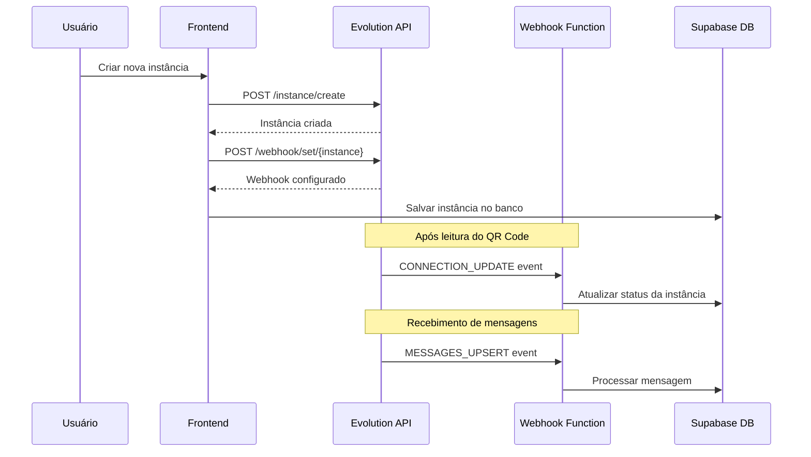

# Plano de Implementação: Configuração Automática de Webhook Evolution API V2

## 1. Análise da Implementação Atual

### 1.1 Estado Atual do Sistema

Atualmente, o sistema possui:
- **Serviço Evolution API** (`src/services/evolutionApi.ts`) com método `createInstance` funcional
- **Hook useEvolutionApi** (`src/hooks/useEvolutionApi.tsx`) que gerencia criação de instâncias
- **Função Edge Supabase** (`supabase/functions/evolution-webhook/index.ts`) para processar webhooks
- **Método setWebhook** já implementado no serviço, mas não utilizado automaticamente

### 1.2 Problemas Identificados

1. **Webhook não configurado automaticamente** após criação de instância
2. **Processo manual** para habilitar recebimento de mensagens
3. **Falta de retry** em caso de falha na configuração do webhook
4. **URL do webhook não definida** dinamicamente

### 1.3 Análise do Código Existente

**Método createInstance atual:**
```typescript
public createInstance = async (params: { instanceName: string; webhookUrl?: string; settings?: any; }) => {
  const body = {
    integration: "WHATSAPP-BAILEYS",
    instanceName,
    qrcode: true,
    rejectCall: true,
    groupsIgnore: true,
    alwaysOnline: true,
    readMessages: true,
    readStatus: true,
    syncFullHistory: true
  };
  // Webhook não é configurado aqui
}
```

**Método setWebhook existente:**
```typescript
async setWebhook(instanceName: string, webhookUrl: string, events: string[]): Promise<void> {
  const payload = {
    webhook: {
      url: webhookUrl,
      events,
    },
  };
  // Implementação correta, mas não utilizada
}
```

## 2. Arquitetura da Solução Proposta

### 2.1 Fluxo Completo de Criação com Webhook



### 2.2 Componentes da Solução

1. **Configuração de Webhook URL Dinâmica**
2. **Modificação do createInstance para incluir webhook**
3. **Sistema de Retry para configuração de webhook**
4. **Eventos essenciais para funcionamento**
5. **Monitoramento e logs**

## 3. Modificações Necessárias no Código

### 3.1 Configuração de Environment Variables

**Adicionar ao `.env`:**
```env
# Webhook Configuration
SUPABASE_WEBHOOK_URL=https://your-project.supabase.co/functions/v1/evolution-webhook
EVOLUTION_WEBHOOK_SECRET=your-webhook-secret
```

### 3.2 Modificação do EvolutionApiService

**Atualizar `src/services/evolutionApi.ts`:**

```typescript
// Adicionar configuração de webhook URL
private getWebhookUrl(): string {
  const baseUrl = import.meta.env.VITE_SUPABASE_URL || process.env.SUPABASE_URL;
  return `${baseUrl}/functions/v1/evolution-webhook`;
}

// Modificar createInstance para incluir webhook automático
public createInstance = async (params: { instanceName: string; webhookUrl?: string; settings?: any; }) => {
  const instanceName = typeof params.instanceName === 'string' 
    ? params.instanceName 
    : params.instanceName?.instanceName || params.instanceName;
  
  // 1. Criar instância
  const body = {
    integration: "WHATSAPP-BAILEYS",
    instanceName,
    qrcode: true,
    rejectCall: true,
    groupsIgnore: true,
    alwaysOnline: true,
    readMessages: true,
    readStatus: true,
    syncFullHistory: true
  };

  const instanceResult = await this.makeRequest('/instance/create', {
    method: 'POST',
    body: JSON.stringify(body)
  });

  // 2. Configurar webhook automaticamente
  await this.setupWebhookWithRetry(instanceName);
  
  return instanceResult;
};

// Novo método para configurar webhook com retry
private async setupWebhookWithRetry(instanceName: string, maxRetries: number = 3): Promise<void> {
  const webhookUrl = this.getWebhookUrl();
  const essentialEvents = [
    'QRCODE_UPDATED',
    'CONNECTION_UPDATE', 
    'MESSAGES_UPSERT',
    'MESSAGES_UPDATE',
    'SEND_MESSAGE'
  ];

  for (let attempt = 1; attempt <= maxRetries; attempt++) {
    try {
      await this.setWebhookEnhanced(instanceName, webhookUrl, essentialEvents);
      console.log(`✅ Webhook configurado com sucesso para ${instanceName}`);
      return;
    } catch (error) {
      console.warn(`⚠️ Tentativa ${attempt}/${maxRetries} falhou para webhook ${instanceName}:`, error);
      
      if (attempt === maxRetries) {
        throw new Error(`Falha ao configurar webhook após ${maxRetries} tentativas: ${error.message}`);
      }
      
      // Aguardar antes da próxima tentativa
      await new Promise(resolve => setTimeout(resolve, 2000 * attempt));
    }
  }
}

// Método aprimorado para configurar webhook
private async setWebhookEnhanced(instanceName: string, webhookUrl: string, events: string[]): Promise<void> {
  const payload = {
    enabled: true,
    url: webhookUrl,
    webhookByEvents: false,
    webhookBase64: true,
    events: events
  };

  await this.makeRequest(`/webhook/set/${instanceName}`, {
    method: 'POST',
    body: JSON.stringify(payload)
  });
}
```

### 3.3 Modificação do Hook useEvolutionApi

**Atualizar `src/hooks/useEvolutionApi.tsx`:**

```typescript
const createInstance = async (name: string, webhookUrl?: string, retryCount = 0) => {
  const maxRetries = 3;
  const retryDelay = 2000;
  
  if (!service) throw new Error('Serviço Evolution API não inicializado');

  try {
    setLoading(true);
    
    // Create instance in Evolution API (agora com webhook automático)
    const newInstance = await service.createInstance({ instanceName: name, webhookUrl });
    
    // Save to database
    const { data: { user } } = await supabase.auth.getUser();
    const { data: profile } = await supabase
      .from('profiles')
      .select('tenant_id')
      .eq('user_id', user!.id)
      .single();

    await supabase.from('whatsapp_instances').insert({
      instance_key: name,
      name,
      tenant_id: profile!.tenant_id,
      status: newInstance.status || 'disconnected',
      webhook_url: service.getWebhookUrl(), // Salvar URL do webhook
      webhook_enabled: true, // Marcar como habilitado
    });

    await refreshInstances();
    
    toast({
      title: "Sucesso",
      description: "Instância criada e webhook configurado automaticamente",
    });
  } catch (err) {
    // Tratamento de erro existente...
  } finally {
    setLoading(false);
  }
};
```

### 3.4 Atualização da Função Edge Webhook

**Melhorar `supabase/functions/evolution-webhook/index.ts`:**

```typescript
// Adicionar validação de segurança
const validateWebhookSecurity = (req: Request): boolean => {
  const expectedSecret = Deno.env.get('EVOLUTION_WEBHOOK_SECRET');
  const receivedSecret = req.headers.get('x-webhook-secret');
  
  if (expectedSecret && receivedSecret !== expectedSecret) {
    return false;
  }
  
  return true;
};

// Adicionar no início da função serve
if (!validateWebhookSecurity(req)) {
  throw new SecureError('Unauthorized webhook request', 'UNAUTHORIZED', 401);
}

// Adicionar logging melhorado para monitoramento
logger.info('Webhook event processed', {
  event: eventType,
  instance: instanceName,
  timestamp: new Date().toISOString(),
  processingTime: Date.now() - startTime
});
```

## 4. Configuração de Eventos Essenciais

### 4.1 Eventos Obrigatórios para Funcionamento

```typescript
const ESSENTIAL_WEBHOOK_EVENTS = [
  'QRCODE_UPDATED',      // Para atualizar QR Code na interface
  'CONNECTION_UPDATE',   // Para status de conexão
  'MESSAGES_UPSERT',     // Para receber mensagens
  'MESSAGES_UPDATE',     // Para status de entrega
  'SEND_MESSAGE'         // Para confirmação de envio
];

const OPTIONAL_WEBHOOK_EVENTS = [
  'PRESENCE_UPDATE',     // Status online/offline
  'CONTACTS_UPSERT',     // Sincronização de contatos
  'CHATS_UPSERT'         // Sincronização de conversas
];
```

### 4.2 Configuração por Tipo de Uso

**Para Chatbots:**
```typescript
const CHATBOT_EVENTS = [
  ...ESSENTIAL_WEBHOOK_EVENTS,
  'PRESENCE_UPDATE',
  'CONTACTS_UPSERT'
];
```

**Para CRM/Atendimento:**
```typescript
const CRM_EVENTS = [
  ...ESSENTIAL_WEBHOOK_EVENTS,
  'CHATS_UPSERT',
  'CONTACTS_UPSERT',
  'PRESENCE_UPDATE'
];
```

## 5. Sistema de Monitoramento e Logs

### 5.1 Tabela de Logs de Webhook

**Criar migração SQL:**
```sql
CREATE TABLE webhook_logs (
  id UUID PRIMARY KEY DEFAULT gen_random_uuid(),
  instance_name VARCHAR(255) NOT NULL,
  event_type VARCHAR(100) NOT NULL,
  status VARCHAR(50) NOT NULL, -- 'success', 'error', 'retry'
  processing_time_ms INTEGER,
  error_message TEXT,
  created_at TIMESTAMP WITH TIME ZONE DEFAULT NOW()
);

CREATE INDEX idx_webhook_logs_instance ON webhook_logs(instance_name);
CREATE INDEX idx_webhook_logs_event_type ON webhook_logs(event_type);
CREATE INDEX idx_webhook_logs_status ON webhook_logs(status);
```

### 5.2 Dashboard de Monitoramento

**Componente para monitorar webhooks:**
```typescript
// src/components/whatsapp/WebhookMonitoring.tsx
export const WebhookMonitoring = () => {
  const [webhookStats, setWebhookStats] = useState(null);
  
  // Buscar estatísticas de webhook
  // Exibir gráficos de performance
  // Mostrar erros recentes
  // Permitir reconfiguração manual
};
```

## 6. Tratamento de Erros e Recovery

### 6.1 Cenários de Erro

1. **Falha na criação da instância**
2. **Falha na configuração do webhook**
3. **Webhook não recebendo eventos**
4. **Instância desconectada**

### 6.2 Estratégias de Recovery

```typescript
// Verificação periódica de saúde do webhook
const checkWebhookHealth = async (instanceName: string): Promise<boolean> => {
  try {
    // Verificar se webhook está configurado
    const webhookInfo = await service.getWebhookInfo(instanceName);
    
    // Verificar se eventos estão sendo recebidos
    const recentEvents = await supabase
      .from('webhook_logs')
      .select('*')
      .eq('instance_name', instanceName)
      .gte('created_at', new Date(Date.now() - 5 * 60 * 1000).toISOString())
      .limit(1);
    
    return recentEvents.data && recentEvents.data.length > 0;
  } catch (error) {
    return false;
  }
};

// Reconfiguração automática em caso de falha
const reconfigureWebhookIfNeeded = async (instanceName: string): Promise<void> => {
  const isHealthy = await checkWebhookHealth(instanceName);
  
  if (!isHealthy) {
    console.log(`🔄 Reconfigurando webhook para ${instanceName}`);
    await service.setupWebhookWithRetry(instanceName);
  }
};
```

## 7. Testes e Validação

### 7.1 Testes Unitários

```typescript
// tests/evolutionApi.test.ts
describe('EvolutionApiService', () => {
  test('should create instance and configure webhook automatically', async () => {
    const service = new EvolutionApiService(mockUrl, mockApiKey);
    
    const result = await service.createInstance({ instanceName: 'test-instance' });
    
    expect(result).toBeDefined();
    expect(mockSetWebhook).toHaveBeenCalledWith(
      'test-instance',
      expect.stringContaining('evolution-webhook'),
      expect.arrayContaining(['MESSAGES_UPSERT'])
    );
  });
  
  test('should retry webhook configuration on failure', async () => {
    // Simular falha na primeira tentativa
    mockSetWebhook.mockRejectedValueOnce(new Error('Network error'));
    mockSetWebhook.mockResolvedValueOnce(undefined);
    
    await service.setupWebhookWithRetry('test-instance');
    
    expect(mockSetWebhook).toHaveBeenCalledTimes(2);
  });
});
```

### 7.2 Testes de Integração

```typescript
// tests/webhook-integration.test.ts
describe('Webhook Integration', () => {
  test('should receive and process MESSAGES_UPSERT event', async () => {
    const mockEvent = {
      event: 'messages.upsert',
      instance: 'test-instance',
      data: {
        key: { id: 'msg-123', remoteJid: '5511999999999@s.whatsapp.net' },
        message: { conversation: 'Hello World' },
        messageTimestamp: Date.now() / 1000
      }
    };
    
    const response = await fetch('/functions/v1/evolution-webhook', {
      method: 'POST',
      headers: { 'Content-Type': 'application/json' },
      body: JSON.stringify(mockEvent)
    });
    
    expect(response.status).toBe(200);
    
    // Verificar se mensagem foi salva no banco
    const { data: messages } = await supabase
      .from('messages')
      .select('*')
      .eq('evolution_message_id', 'msg-123');
    
    expect(messages).toHaveLength(1);
    expect(messages[0].content).toBe('Hello World');
  });
});
```

### 7.3 Checklist de Validação

- [ ] Instância criada com sucesso
- [ ] Webhook configurado automaticamente
- [ ] QR Code atualizado via webhook
- [ ] Status de conexão atualizado
- [ ] Mensagens recebidas e processadas
- [ ] Retry funcionando em caso de falha
- [ ] Logs sendo gerados corretamente
- [ ] Dashboard de monitoramento funcional

## 8. Implementação Gradual

### 8.1 Fase 1: Configuração Básica
- Implementar configuração automática de webhook
- Adicionar eventos essenciais
- Testes básicos

### 8.2 Fase 2: Robustez
- Sistema de retry
- Monitoramento e logs
- Tratamento de erros

### 8.3 Fase 3: Otimização
- Dashboard de monitoramento
- Métricas de performance
- Configuração avançada por tipo de uso

## 9. Considerações de Segurança

### 9.1 Validação de Webhook
- Verificar origem das requisições
- Implementar secret para validação
- Rate limiting

### 9.2 Sanitização de Dados
- Validar todos os dados recebidos
- Sanitizar conteúdo de mensagens
- Logs seguros (sem dados sensíveis)

## 10. Conclusão

Este plano fornece uma implementação completa e robusta para configuração automática de webhooks na Evolution API V2. A solução garante:

- **Automatização completa** do processo de configuração
- **Robustez** com sistema de retry e recovery
- **Monitoramento** em tempo real
- **Segurança** adequada
- **Escalabilidade** para diferentes tipos de uso

A implementação deve ser feita de forma gradual, começando pela configuração básica e evoluindo para funcionalidades mais avançadas.