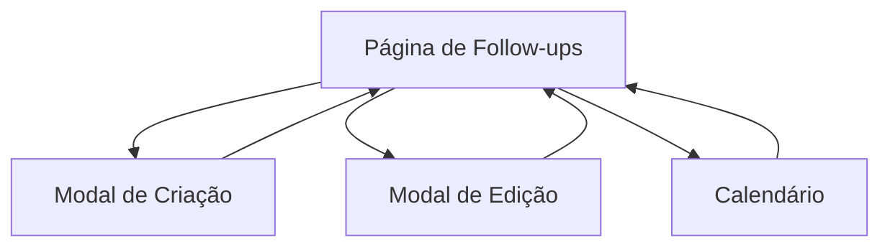

# Requisitos para Funcionalidade de Edição de Follow-ups

## 1. Visão Geral do Produto

Implementação da funcionalidade completa de edição de follow-ups individuais na página de Follow-ups do ConvoFlow. O sistema permitirá aos usuários criar, visualizar, editar e excluir follow-ups agendados individualmente, diferente das sequências automáticas existentes.

## 2. Funcionalidades Principais

### 2.1 Papéis de Usuário

| Papel | Método de Registro | Permissões Principais |
|-------|-------------------|----------------------|
| Usuário Autenticado | Login com email/senha | Pode gerenciar follow-ups do seu tenant |
| Super Admin | Acesso administrativo | Pode visualizar todos os follow-ups |

### 2.2 Módulos de Funcionalidade

Nossos requisitos de follow-ups consistem nas seguintes páginas principais:
1. **Página de Follow-ups**: listagem de follow-ups, filtros por status, estatísticas rápidas
2. **Modal de Agendamento**: criação de novos follow-ups individuais
3. **Modal de Edição**: edição de follow-ups existentes
4. **Calendário de Follow-ups**: visualização em calendário dos agendamentos

### 2.3 Detalhes das Páginas

| Nome da Página | Nome do Módulo | Descrição da Funcionalidade |
|----------------|----------------|-----------------------------|
| Página de Follow-ups | Lista de Follow-ups | Exibir follow-ups por status (pendentes, hoje, concluídos, atrasados). Incluir botões funcionais de editar, concluir e executar ação |
| Página de Follow-ups | Estatísticas Rápidas | Mostrar contadores em tempo real: total, pendentes, concluídos hoje, atrasados |
| Modal de Agendamento | Formulário de Criação | Criar novos follow-ups com campos: contato, tarefa, data/hora, prioridade, tipo, notas, recorrência |
| Modal de Edição | Formulário de Edição | Editar follow-ups existentes com todos os campos editáveis e opção de exclusão |
| Calendário | Visualização Mensal | Exibir follow-ups agendados em formato de calendário com navegação por mês |

## 3. Processo Principal

**Fluxo do Usuário Autenticado:**
1. Usuário acessa a página de Follow-ups
2. Visualiza lista de follow-ups filtrados por status
3. Pode criar novo follow-up clicando em "Novo Follow-up"
4. Pode editar follow-up existente clicando em "Editar"
5. Pode marcar follow-up como concluído
6. Pode executar ação do follow-up (ligar, enviar email, WhatsApp)
7. Pode visualizar follow-ups no calendário

## 4. Design da Interface do Usuário

### 4.1 Estilo de Design

- **Cores primárias e secundárias**: Verde (#22c55e) para ações positivas, azul (#3b82f6) para informações, vermelho (#ef4444) para alertas
- **Estilo de botões**: Arredondados com sombra sutil
- **Fonte e tamanhos preferenciais**: Inter, tamanhos 14px (corpo), 16px (títulos), 12px (legendas)
- **Estilo de layout**: Baseado em cards com navegação superior por abas
- **Sugestões para emojis ou ícones**: Lucide React icons para consistência

### 4.2 Visão Geral do Design das Páginas

| Nome da Página | Nome do Módulo | Elementos da UI |
|----------------|----------------|----------------|
| Página de Follow-ups | Header | Título "Follow-ups", botões "Calendário" e "Novo Follow-up" alinhados à direita |
| Página de Follow-ups | Estatísticas | 4 cards com ícones, números grandes e descrições. Cores: azul (total), laranja (pendentes), verde (concluídos), vermelho (atrasados) |
| Página de Follow-ups | Abas de Filtro | Tabs horizontais: Pendentes, Hoje, Concluídos, Em Atraso |
| Página de Follow-ups | Lista de Cards | Cards com borda colorida à esquerda, avatar do contato, badges de prioridade e tipo, botões de ação |
| Modal de Edição | Formulário | Campos organizados em grid 2 colunas, labels claros, validação visual, botões "Cancelar", "Excluir" e "Salvar" |

### 4.3 Responsividade

O produto é desktop-first com adaptação mobile. Considera otimização para interação touch em dispositivos móveis, com botões maiores e espaçamento adequado.