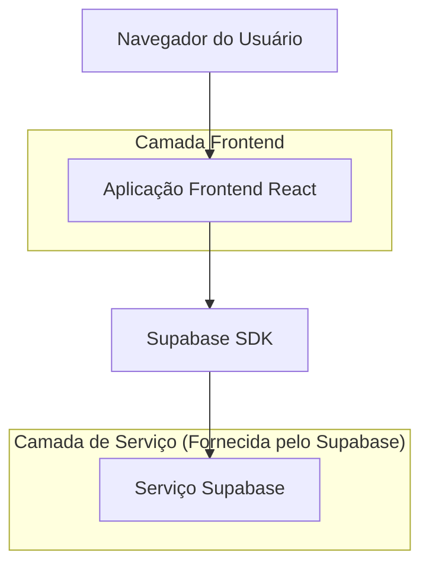
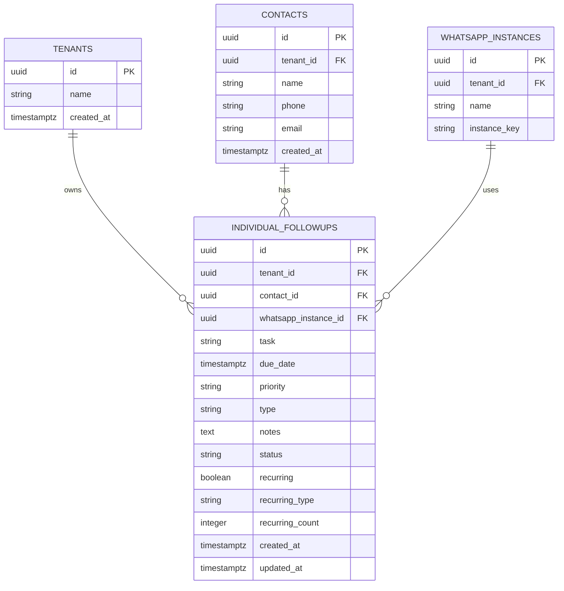

# Arquitetura Técnica - Funcionalidade de Follow-ups Individuais

## 1. Design da Arquitetura



## 2. Descrição da Tecnologia

* Frontend: React\@18 + TypeScript + TailwindCSS\@3 + Vite

* Backend: Supabase (PostgreSQL + Auth + RLS)

* Bibliotecas: Lucide React (ícones), Radix UI (componentes), React Hook Form (formulários)

## 3. Definições de Rotas

| Rota                      | Propósito                                             |
| ------------------------- | ----------------------------------------------------- |
| /follow-ups               | Página principal de follow-ups com listagem e filtros |
| /follow-ups?calendar=true | Página de follow-ups com modal de calendário aberto   |
| /follow-ups?new=true      | Página de follow-ups com modal de criação aberto      |
| /follow-ups?edit={id}     | Página de follow-ups com modal de edição aberto       |

## 4. Definições de API

### 4.1 API Principal

**Operações CRUD para Follow-ups Individuais**

```typescript
// Criar follow-up
POST /rest/v1/individual_followups
```

Request:

| Nome do Parâmetro | Tipo do Parâmetro | Obrigatório | Descrição                           |
| ----------------- | ----------------- | ----------- | ----------------------------------- |
| contact\_id       | uuid              | true        | ID do contato                       |
| task              | string            | true        | Descrição da tarefa                 |
| due\_date         | timestamptz       | true        | Data e hora de vencimento           |
| priority          | string            | true        | Prioridade: 'high', 'medium', 'low' |
| type              | string            | true        | Tipo: 'call', 'email', 'whatsapp'   |
| notes             | string            | false       | Notas adicionais                    |
| recurring         | boolean           | false       | Se é recorrente                     |
| recurring\_type   | string            | false       | Tipo de recorrência                 |
| recurring\_count  | integer           | false       | Quantidade de repetições            |

Response:

| Nome do Parâmetro | Tipo do Parâmetro | Descrição              |
| ----------------- | ----------------- | ---------------------- |
| id                | uuid              | ID do follow-up criado |
| status            | string            | Status da operação     |

Exemplo:

```json
{
  "contact_id": "123e4567-e89b-12d3-a456-426614174000",
  "task": "Ligar para apresentar nova proposta",
  "due_date": "2024-01-25T14:00:00Z",
  "priority": "high",
  "type": "call",
  "notes": "Cliente interessado em plano premium"
}
```

```typescript
// Atualizar follow-up
PATCH /rest/v1/individual_followups?id=eq.{id}
```

Request:

| Nome do Parâmetro | Tipo do Parâmetro | Obrigatório | Descrição                |
| ----------------- | ----------------- | ----------- | ------------------------ |
| task              | string            | false       | Nova descrição da tarefa |
| due\_date         | timestamptz       | false       | Nova data de vencimento  |
| priority          | string            | false       | Nova prioridade          |
| type              | string            | false       | Novo tipo                |
| notes             | string            | false       | Novas notas              |
| status            | string            | false       | Novo status              |

```typescript
// Listar follow-ups
GET /rest/v1/individual_followups?select=*,contacts(name,phone)
```

Response:

| Nome do Parâmetro | Tipo do Parâmetro | Descrição                                |
| ----------------- | ----------------- | ---------------------------------------- |
| data              | array             | Lista de follow-ups com dados do contato |

```typescript
// Deletar follow-up
DELETE /rest/v1/individual_followups?id=eq.{id}
```

## 5. Modelo de Dados

### 5.1 Definição do Modelo de Dados



### 5.2 Linguagem de Definição de Dados

**Tabela de Follow-ups Individuais (individual\_followups)**

```sql
-- Criar tabela
CREATE TABLE public.individual_followups (
    id UUID PRIMARY KEY DEFAULT gen_random_uuid(),
    tenant_id UUID NOT NULL REFERENCES public.tenants(id) ON DELETE CASCADE,
    contact_id UUID NOT NULL REFERENCES public.contacts(id) ON DELETE CASCADE,
    whatsapp_instance_id UUID REFERENCES public.whatsapp_instances(id),
    task TEXT NOT NULL,
    due_date TIMESTAMPTZ NOT NULL,
    priority TEXT NOT NULL CHECK (priority IN ('high', 'medium', 'low')),
    type TEXT NOT NULL CHECK (type IN ('call', 'email', 'whatsapp')),
    notes TEXT,
    status TEXT DEFAULT 'pending' CHECK (status IN ('pending', 'completed', 'cancelled')),
    recurring BOOLEAN DEFAULT false,
    recurring_type TEXT CHECK (recurring_type IN ('daily', 'weekly', 'monthly')),
    recurring_count INTEGER DEFAULT 0,
    created_at TIMESTAMPTZ NOT NULL DEFAULT NOW(),
    updated_at TIMESTAMPTZ NOT NULL DEFAULT NOW()
);

-- Criar índices
CREATE INDEX idx_individual_followups_tenant_id ON public.individual_followups(tenant_id);
CREATE INDEX idx_individual_followups_contact_id ON public.individual_followups(contact_id);
CREATE INDEX idx_individual_followups_due_date ON public.individual_followups(due_date);
CREATE INDEX idx_individual_followups_status ON public.individual_followups(status);
CREATE INDEX idx_individual_followups_priority ON public.individual_followups(priority);

-- Trigger para atualizar updated_at
CREATE TRIGGER update_individual_followups_updated_at 
    BEFORE UPDATE ON public.individual_followups 
    FOR EACH ROW 
    EXECUTE FUNCTION public.update_updated_at_column();

-- Políticas RLS
ALTER TABLE public.individual_followups ENABLE ROW LEVEL SECURITY;

-- Usuários podem acessar follow-ups do próprio tenant
CREATE POLICY "Users can access own tenant individual followups" 
    ON public.individual_followups
    FOR ALL 
    USING (tenant_id = public.get_current_user_tenant_id());

-- Super admins podem acessar todos os follow-ups
CREATE POLICY "Super admins can access all individual followups" 
    ON public.individual_followups
    FOR ALL 
    USING (public.is_super_admin());

-- Permissões básicas
GRANT SELECT ON public.individual_followups TO anon;
GRANT ALL PRIVILEGES ON public.individual_followups TO authenticated;

-- Dados iniciais para teste
INSERT INTO public.individual_followups (
    tenant_id, 
    contact_id, 
    task, 
    due_date, 
    priority, 
    type, 
    notes
) VALUES (
    (SELECT id FROM public.tenants LIMIT 1),
    (SELECT id FROM public.contacts LIMIT 1),
    'Follow-up de teste',
    NOW() + INTERVAL '1 day',
    'medium',
    'call',
    'Este é um follow-up de teste criado durante a migração'
) ON CONFLICT DO NOTHING;
```

**Função para obter estatísticas de follow-ups**

```sql
-- Função para calcular estatísticas de follow-ups
CREATE OR REPLACE FUNCTION public.get_followup_stats(p_tenant_id UUID)
RETURNS JSON
LANGUAGE plpgsql
SECURITY DEFINER
AS $$
DECLARE
    result JSON;
BEGIN
    SELECT json_build_object(
        'total', COUNT(*),
        'pending', COUNT(*) FILTER (WHERE status = 'pending'),
        'completed_today', COUNT(*) FILTER (
            WHERE status = 'completed' 
            AND DATE(updated_at) = CURRENT_DATE
        ),
        'overdue', COUNT(*) FILTER (
            WHERE status = 'pending' 
            AND due_date < NOW()
        )
    )
    INTO result
    FROM public.individual_followups
    WHERE tenant_id = p_tenant_id;
    
    RETURN result;
END;
$$;
```

