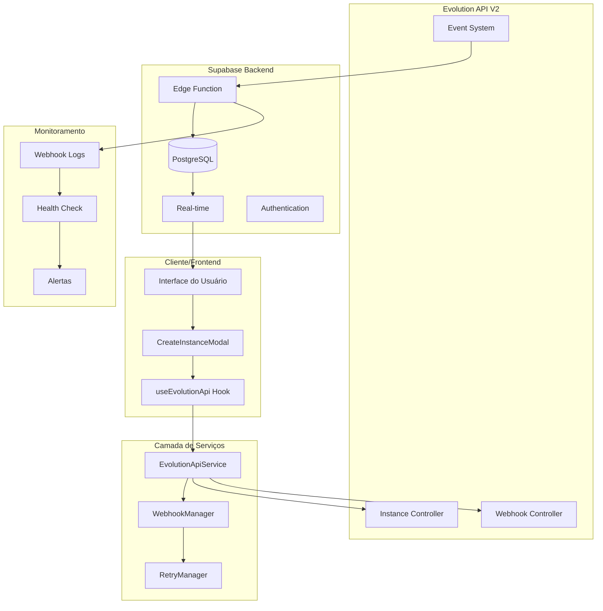
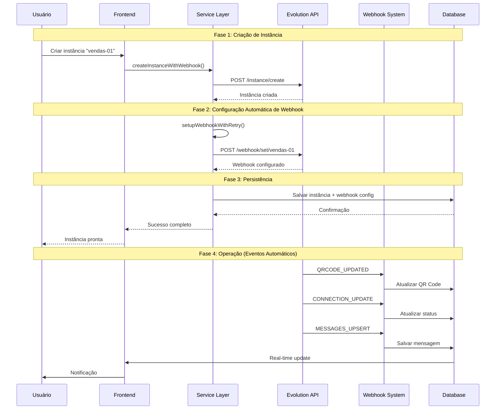
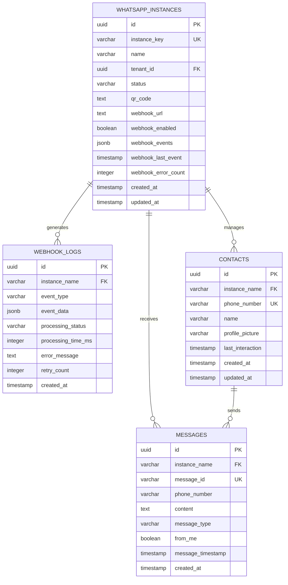
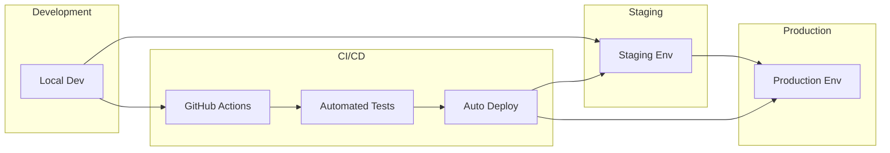

# Arquitetura de Automação de Webhook - Evolution API V2

## 1. Visão Geral da Arquitetura

### 1.1 Diagrama de Arquitetura Geral



### 1.2 Fluxo de Dados Principal



## 2. Componentes da Arquitetura

### 2.1 Frontend Layer

#### CreateInstanceModal
- **Responsabilidade**: Interface para criação de instâncias
- **Funcionalidades**:
  - Formulário de criação
  - Seleção de eventos de webhook
  - Exibição de QR Code
  - Status de webhook em tempo real
  - Monitoramento de conexão

#### useEvolutionApi Hook
- **Responsabilidade**: Gerenciamento de estado e comunicação com API
- **Funcionalidades**:
  - Criação de instâncias com webhook automático
  - Verificação de saúde do webhook
  - Reconfiguração de webhook
  - Gerenciamento de cache local

### 2.2 Service Layer

#### EvolutionApiService
- **Responsabilidade**: Comunicação com Evolution API V2
- **Funcionalidades**:
  - Criação de instâncias
  - Configuração de webhooks
  - Sistema de retry
  - Validação de respostas

#### WebhookManager
- **Responsabilidade**: Gerenciamento avançado de webhooks
- **Funcionalidades**:
  - Configuração automática
  - Monitoramento de saúde
  - Reconfiguração automática
  - Logs detalhados

#### RetryManager
- **Responsabilidade**: Sistema de tentativas e recuperação
- **Funcionalidades**:
  - Retry exponencial
  - Circuit breaker
  - Fallback strategies
  - Métricas de falhas

### 2.3 Backend Layer (Supabase)

#### Edge Function (evolution-webhook)
- **Responsabilidade**: Processamento de eventos de webhook
- **Funcionalidades**:
  - Validação de eventos
  - Processamento de mensagens
  - Atualização de status
  - Logs de auditoria

#### Database Schema
- **Tabelas principais**:
  - `whatsapp_instances`: Instâncias e configurações
  - `webhook_logs`: Logs de eventos
  - `messages`: Mensagens recebidas
  - `contacts`: Contatos sincronizados

## 3. Tecnologias e Dependências

### 3.1 Stack Tecnológico

| Camada | Tecnologia | Versão | Propósito |
|--------|------------|--------|-----------|
| Frontend | React | 18+ | Interface do usuário |
| State Management | Zustand/Context | Latest | Gerenciamento de estado |
| HTTP Client | Fetch API | Native | Comunicação com APIs |
| UI Components | shadcn/ui | Latest | Componentes de interface |
| Styling | Tailwind CSS | 3+ | Estilização |
| Backend | Supabase | Latest | Backend-as-a-Service |
| Database | PostgreSQL | 15+ | Banco de dados |
| Real-time | Supabase Realtime | Latest | Atualizações em tempo real |
| Edge Functions | Deno | Latest | Processamento serverless |

### 3.2 APIs Externas

| API | Versão | Propósito | Documentação |
|-----|--------|-----------|-------------|
| Evolution API | V2 | WhatsApp Business | https://doc.evolution-api.com/v2 |

### 3.3 Variáveis de Ambiente

```env
# Evolution API
VITE_EVOLUTION_API_URL=https://api.evolution.com
VITE_EVOLUTION_API_KEY=your_api_key

# Supabase
VITE_SUPABASE_URL=https://your-project.supabase.co
VITE_SUPABASE_ANON_KEY=your_anon_key
SUPABASE_SERVICE_ROLE_KEY=your_service_role_key

# Webhook
WEBHOOK_SECRET=your_webhook_secret
WEBHOOK_TIMEOUT=30000
```

## 4. Definições de API

### 4.1 APIs Frontend

#### useEvolutionApi Hook

```typescript
interface UseEvolutionApiReturn {
  // Instâncias
  instances: WhatsAppInstance[];
  loading: boolean;
  
  // Operações principais
  createInstance: (name: string, events?: string[]) => Promise<InstanceResult>;
  deleteInstance: (name: string) => Promise<void>;
  
  // Conexão
  connectInstance: (name: string) => Promise<void>;
  disconnectInstance: (name: string) => Promise<void>;
  getQRCode: (name: string) => Promise<string>;
  
  // Webhook
  checkWebhookHealth: (name: string) => Promise<WebhookHealth>;
  reconfigureWebhook: (name: string, events?: string[]) => Promise<void>;
  
  // Mensagens
  sendMessage: (instanceName: string, message: MessagePayload) => Promise<void>;
  
  // Utilitários
  refreshInstances: () => Promise<void>;
}

interface InstanceResult {
  instanceName: string;
  status: string;
  webhookConfigured: boolean;
  webhookUrl: string;
  webhookEvents: string[];
}

interface WebhookHealth {
  isHealthy: boolean;
  lastEvent?: Date;
  configuredEvents?: string[];
  errorRate?: number;
}
```

### 4.2 APIs Backend (Evolution API V2)

#### Criação de Instância

```http
POST /instance/create
Content-Type: application/json
Authorization: Bearer {api_key}

{
  "integration": "WHATSAPP-BAILEYS",
  "instanceName": "vendas-01",
  "qrcode": true,
  "rejectCall": true,
  "groupsIgnore": true,
  "alwaysOnline": true,
  "readMessages": true,
  "readStatus": true,
  "syncFullHistory": true
}
```

#### Configuração de Webhook

```http
POST /webhook/set/{instanceName}
Content-Type: application/json
Authorization: Bearer {api_key}

{
  "enabled": true,
  "url": "https://your-project.supabase.co/functions/v1/evolution-webhook",
  "webhookByEvents": false,
  "webhookBase64": true,
  "events": [
    "QRCODE_UPDATED",
    "CONNECTION_UPDATE",
    "MESSAGES_UPSERT",
    "MESSAGES_UPDATE",
    "SEND_MESSAGE"
  ]
}
```

### 4.3 Webhook Events

#### MESSAGES_UPSERT

```json
{
  "event": "messages.upsert",
  "instance": "vendas-01",
  "data": {
    "key": {
      "id": "3EB0C767D82B632A2E",
      "remoteJid": "5511999999999@s.whatsapp.net",
      "fromMe": false
    },
    "message": {
      "conversation": "Olá, preciso de ajuda!"
    },
    "messageTimestamp": 1703123456
  }
}
```

#### CONNECTION_UPDATE

```json
{
  "event": "connection.update",
  "instance": "vendas-01",
  "data": {
    "state": "open",
    "connection": "open"
  }
}
```

#### QRCODE_UPDATED

```json
{
  "event": "qrcode.updated",
  "instance": "vendas-01",
  "data": {
    "qrcode": "data:image/png;base64,iVBORw0KGgoAAAANSUhEUgAA..."
  }
}
```

## 5. Modelo de Dados

### 5.1 Diagrama ER



### 5.2 Definições de Tabelas

#### whatsapp_instances

```sql
CREATE TABLE whatsapp_instances (
  id UUID PRIMARY KEY DEFAULT gen_random_uuid(),
  instance_key VARCHAR(255) UNIQUE NOT NULL,
  name VARCHAR(255) NOT NULL,
  tenant_id UUID NOT NULL REFERENCES tenants(id),
  status VARCHAR(50) DEFAULT 'disconnected',
  qr_code TEXT,
  webhook_url TEXT,
  webhook_enabled BOOLEAN DEFAULT false,
  webhook_events JSONB DEFAULT '[]'::jsonb,
  webhook_last_event TIMESTAMP WITH TIME ZONE,
  webhook_error_count INTEGER DEFAULT 0,
  created_at TIMESTAMP WITH TIME ZONE DEFAULT NOW(),
  updated_at TIMESTAMP WITH TIME ZONE DEFAULT NOW()
);
```

#### webhook_logs

```sql
CREATE TABLE webhook_logs (
  id UUID PRIMARY KEY DEFAULT gen_random_uuid(),
  instance_name VARCHAR(255) NOT NULL,
  event_type VARCHAR(100) NOT NULL,
  event_data JSONB,
  processing_status VARCHAR(50) NOT NULL,
  processing_time_ms INTEGER,
  error_message TEXT,
  retry_count INTEGER DEFAULT 0,
  created_at TIMESTAMP WITH TIME ZONE DEFAULT NOW()
);
```

## 6. Segurança e Autenticação

### 6.1 Autenticação

- **Frontend**: Supabase Auth (JWT)
- **Evolution API**: API Key
- **Webhook**: Secret validation
- **Database**: Row Level Security (RLS)

### 6.2 Autorização

```sql
-- RLS Policy para whatsapp_instances
CREATE POLICY "Users can manage their instances" ON whatsapp_instances
FOR ALL USING (
  tenant_id = (SELECT tenant_id FROM profiles WHERE user_id = auth.uid())
);

-- RLS Policy para webhook_logs
CREATE POLICY "Users can view their webhook logs" ON webhook_logs
FOR SELECT USING (
  instance_name IN (
    SELECT instance_key FROM whatsapp_instances 
    WHERE tenant_id = (SELECT tenant_id FROM profiles WHERE user_id = auth.uid())
  )
);
```

### 6.3 Validação de Webhook

```typescript
// Validação de assinatura do webhook
const validateWebhookSignature = (payload: string, signature: string): boolean => {
  const expectedSignature = crypto
    .createHmac('sha256', process.env.WEBHOOK_SECRET!)
    .update(payload)
    .digest('hex');
  
  return crypto.timingSafeEqual(
    Buffer.from(signature),
    Buffer.from(expectedSignature)
  );
};
```

## 7. Monitoramento e Observabilidade

### 7.1 Métricas Principais

- **Disponibilidade**: Uptime dos webhooks
- **Latência**: Tempo de processamento de eventos
- **Taxa de Erro**: Percentual de falhas
- **Throughput**: Eventos processados por minuto

### 7.2 Logs Estruturados

```typescript
interface WebhookLog {
  timestamp: string;
  level: 'info' | 'warn' | 'error';
  instance_name: string;
  event_type: string;
  processing_time_ms: number;
  status: 'success' | 'error' | 'retry';
  error_message?: string;
  metadata: Record<string, any>;
}
```

### 7.3 Alertas

- **Webhook Down**: Sem eventos por > 5 minutos
- **Alta Taxa de Erro**: > 10% de falhas em 1 hora
- **Latência Alta**: Tempo de processamento > 5 segundos
- **Instância Desconectada**: Status != 'open' por > 10 minutos

## 8. Deployment e DevOps

### 8.1 Estrutura de Deployment



### 8.2 Configuração de Ambientes

#### Development
```env
VITE_EVOLUTION_API_URL=http://localhost:8080
VITE_SUPABASE_URL=http://localhost:54321
```

#### Staging
```env
VITE_EVOLUTION_API_URL=https://staging-api.evolution.com
VITE_SUPABASE_URL=https://staging-project.supabase.co
```

#### Production
```env
VITE_EVOLUTION_API_URL=https://api.evolution.com
VITE_SUPABASE_URL=https://production-project.supabase.co
```

## 9. Escalabilidade e Performance

### 9.1 Estratégias de Escalabilidade

- **Horizontal**: Múltiplas instâncias de Edge Functions
- **Vertical**: Otimização de queries e índices
- **Cache**: Redis para dados frequentes
- **CDN**: Assets estáticos

### 9.2 Otimizações de Performance

- **Database**: Índices otimizados
- **Frontend**: Code splitting e lazy loading
- **API**: Connection pooling
- **Webhook**: Processamento assíncrono

### 9.3 Limites e Quotas

| Recurso | Limite | Observação |
|---------|--------|------------|
| Instâncias por tenant | 50 | Configurável |
| Webhooks por segundo | 1000 | Rate limiting |
| Logs retention | 30 dias | Configurável |
| Message history | 1 ano | Configurável |

## 10. Manutenção e Suporte

### 10.1 Procedimentos de Manutenção

- **Backup**: Diário automático
- **Updates**: Deployment sem downtime
- **Monitoring**: 24/7 automated
- **Health checks**: A cada 30 segundos

### 10.2 Troubleshooting

#### Webhook não funciona
1. Verificar configuração na Evolution API
2. Validar URL do webhook
3. Checar logs de erro
4. Reconfigurar webhook

#### Instância não conecta
1. Verificar QR Code
2. Validar status na Evolution API
3. Checar logs de conexão
4. Reiniciar instância

#### Performance degradada
1. Analisar métricas de database
2. Verificar logs de erro
3. Otimizar queries lentas
4. Escalar recursos se necessário

Esta arquitetura garante uma solução robusta, escalável e maintível para automação de webhooks na Evolution API V2.