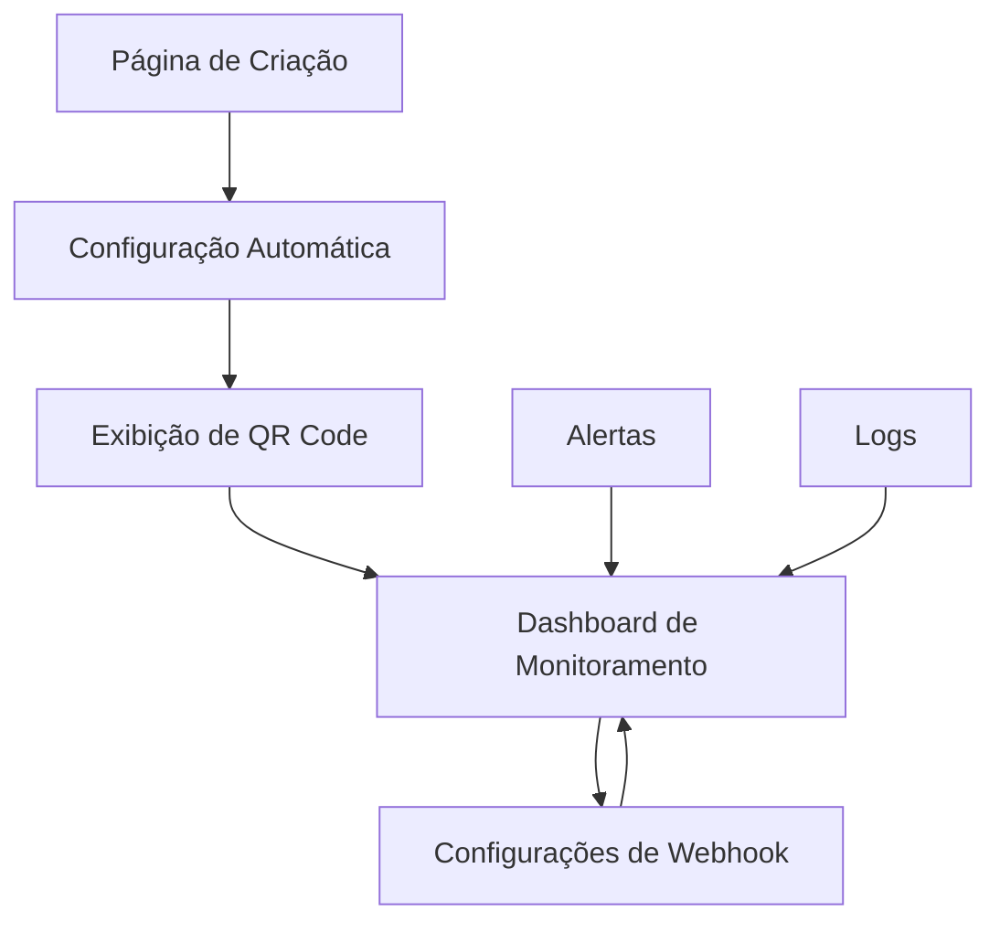

# PRD: Automação de Webhook para Instâncias WhatsApp

## 1. Visão Geral do Produto

Este documento define os requisitos para implementar a automação completa de configuração de webhooks na criação de instâncias WhatsApp usando a Evolution API V2. O objetivo é eliminar a configuração manual de webhooks, garantindo que todas as instâncias criadas tenham recepção automática de mensagens funcionando imediatamente após a conexão via QR Code.

A funcionalidade resolve o problema atual onde webhooks precisam ser configurados manualmente após a criação de instâncias, causando perda de mensagens e complexidade operacional. O produto será usado por administradores e usuários que gerenciam múltiplas instâncias WhatsApp para atendimento, vendas e suporte.

O valor esperado é redução de 90% no tempo de configuração de instâncias e eliminação completa de perda de mensagens por configuração incorreta de webhook.

## 2. Funcionalidades Principais

### 2.1 Papéis de Usuário

| Papel | Método de Registro | Permissões Principais |
|-------|-------------------|----------------------|
| Administrador | Convite do sistema | Pode criar, configurar e monitorar todas as instâncias do tenant |
| Operador | Convite do administrador | Pode criar e usar instâncias, visualizar logs básicos |
| Usuário Final | Não aplicável | Recebe mensagens através das instâncias configuradas |

### 2.2 Módulos de Funcionalidade

Nossos requisitos de automação de webhook consistem nas seguintes páginas principais:

1. **Página de Criação de Instância**: formulário de criação, seleção de eventos, configuração automática de webhook, exibição de QR Code com status em tempo real.

2. **Dashboard de Monitoramento**: status de saúde dos webhooks, métricas de eventos processados, logs de atividade, alertas de problemas.

3. **Página de Configurações de Webhook**: reconfiguração de eventos, teste de conectividade, histórico de configurações, troubleshooting.

### 2.3 Detalhes das Páginas

| Nome da Página | Nome do Módulo | Descrição da Funcionalidade |
|----------------|----------------|-----------------------------|
| Criação de Instância | Formulário de Criação | Capturar nome da instância, validar unicidade, gerar chave única automaticamente |
| Criação de Instância | Seleção de Eventos | Permitir escolha entre eventos essenciais (padrão) e eventos avançados (opcional) |
| Criação de Instância | Configuração Automática | Criar instância na Evolution API, configurar webhook automaticamente com retry, salvar no banco de dados |
| Criação de Instância | Exibição de QR Code | Mostrar QR Code em tempo real, atualizar status de conexão, indicar quando webhook está ativo |
| Dashboard de Monitoramento | Status de Saúde | Exibir status de cada webhook (ativo/inativo), última atividade, taxa de sucesso |
| Dashboard de Monitoramento | Métricas de Eventos | Mostrar contadores de eventos processados (24h, 7d, 30d), gráficos de atividade |
| Dashboard de Monitoramento | Logs de Atividade | Listar eventos recentes, filtrar por tipo/instância, exportar logs |
| Dashboard de Monitoramento | Sistema de Alertas | Notificar webhooks inativos, alta taxa de erro, problemas de conectividade |
| Configurações de Webhook | Reconfiguração | Permitir alterar eventos configurados, reconfigurar URL do webhook, aplicar mudanças com validação |
| Configurações de Webhook | Teste de Conectividade | Enviar evento de teste, verificar resposta, validar configuração |
| Configurações de Webhook | Histórico | Mostrar histórico de configurações, mudanças realizadas, rollback se necessário |
| Configurações de Webhook | Troubleshooting | Diagnosticar problemas, sugerir soluções, executar correções automáticas |

## 3. Processo Principal

### Fluxo do Administrador

1. **Criação de Instância**: O administrador acessa a página de criação, preenche o nome da instância, seleciona os tipos de eventos desejados (essenciais ou avançados) e clica em "Criar Instância".

2. **Configuração Automática**: O sistema automaticamente cria a instância na Evolution API, configura o webhook com os eventos selecionados, implementa retry em caso de falha, e salva todas as informações no banco de dados.

3. **Conexão via QR Code**: O sistema exibe o QR Code gerado, atualiza o status em tempo real conforme o usuário escaneia, e confirma quando a conexão é estabelecida e o webhook está ativo.

4. **Monitoramento Contínuo**: O administrador pode acessar o dashboard para monitorar a saúde de todos os webhooks, visualizar métricas de atividade, e receber alertas sobre problemas.

### Fluxo do Operador

1. **Criação Simplificada**: O operador cria instâncias com configurações padrão pré-definidas pelo administrador.

2. **Monitoramento Básico**: Acesso a métricas básicas e logs das instâncias que gerencia.

3. **Suporte**: Pode solicitar ajuda do administrador através do sistema de tickets integrado.

## 4. Design da Interface do Usuário

### 4.1 Estilo de Design

- **Cores Primárias**: Verde WhatsApp (#25D366) para elementos de sucesso, Azul (#1976D2) para ações primárias
- **Cores Secundárias**: Cinza (#F5F5F5) para backgrounds, Vermelho (#F44336) para alertas e erros
- **Estilo de Botões**: Arredondados (border-radius: 8px) com sombra sutil, estados hover e disabled bem definidos
- **Fonte**: Inter ou system font, tamanhos 14px (corpo), 16px (títulos), 12px (labels)
- **Layout**: Design baseado em cards com navegação superior, sidebar colapsável para desktop
- **Ícones**: Lucide React icons, estilo outline, tamanho 20px para ações, 16px para indicadores

### 4.2 Visão Geral do Design das Páginas

| Nome da Página | Nome do Módulo | Elementos de UI |
|----------------|----------------|----------------|
| Criação de Instância | Formulário de Criação | Modal centralizado, input com validação em tempo real, botão primário verde, indicador de progresso |
| Criação de Instância | Seleção de Eventos | Toggle switches para eventos, tooltips explicativos, preview dos eventos selecionados |
| Criação de Instância | Configuração Automática | Spinner de loading, progress bar com etapas, mensagens de status, retry automático visível |
| Criação de Instância | Exibição de QR Code | QR Code centralizado em card branco, status badge colorido, timer de expiração, botão de refresh |
| Dashboard de Monitoramento | Status de Saúde | Grid de cards com status colorido, badges de estado, ícones de status (online/offline/erro) |
| Dashboard de Monitoramento | Métricas de Eventos | Gráficos de linha para tendências, contadores grandes para totais, filtros de período |
| Dashboard de Monitoramento | Logs de Atividade | Tabela com paginação, filtros dropdown, badges para tipos de evento, timestamps relativos |
| Dashboard de Monitoramento | Sistema de Alertas | Toast notifications, badge de contador no ícone, lista de alertas com prioridade |
| Configurações de Webhook | Reconfiguração | Formulário em duas colunas, switches para eventos, botão de aplicar com confirmação |
| Configurações de Webhook | Teste de Conectividade | Botão de teste com loading, resultado em card colorido, detalhes técnicos colapsáveis |
| Configurações de Webhook | Histórico | Timeline vertical, cards de mudanças, botões de rollback, filtros de data |
| Configurações de Webhook | Troubleshooting | Wizard de diagnóstico, checklist de verificações, botões de ação corretiva |

### 4.3 Responsividade

O produto é desktop-first com adaptação mobile completa. Em dispositivos móveis, a sidebar se torna um menu hambúrguer, os cards se empilham verticalmente, e os formulários se ajustam para toque. Otimização específica para tablets inclui layout em duas colunas e gestos de swipe para navegação entre seções.

## 5. Requisitos Técnicos

### 5.1 Requisitos Funcionais

#### RF001 - Criação Automática de Webhook
- O sistema DEVE configurar automaticamente o webhook ao criar uma nova instância
- O sistema DEVE usar eventos essenciais por padrão: QRCODE_UPDATED, CONNECTION_UPDATE, MESSAGES_UPSERT
- O sistema DEVE permitir seleção de eventos avançados opcionais
- O sistema DEVE implementar retry automático com backoff exponencial (3 tentativas)

#### RF002 - Monitoramento de Saúde
- O sistema DEVE verificar a saúde dos webhooks a cada 30 segundos
- O sistema DEVE detectar webhooks inativos (sem eventos por 5 minutos)
- O sistema DEVE calcular taxa de erro e latência média
- O sistema DEVE gerar alertas automáticos para problemas críticos

#### RF003 - Reconfiguração Dinâmica
- O sistema DEVE permitir reconfiguração de webhooks sem recriar a instância
- O sistema DEVE validar configurações antes de aplicar
- O sistema DEVE manter histórico de todas as configurações
- O sistema DEVE permitir rollback para configurações anteriores

#### RF004 - Logs e Auditoria
- O sistema DEVE registrar todos os eventos de webhook recebidos
- O sistema DEVE manter logs por 30 dias (configurável)
- O sistema DEVE permitir filtros por instância, tipo de evento e período
- O sistema DEVE permitir exportação de logs em formato CSV/JSON

### 5.2 Requisitos Não Funcionais

#### RNF001 - Performance
- Tempo de criação de instância com webhook: máximo 10 segundos
- Tempo de processamento de eventos de webhook: máximo 2 segundos
- Suporte a mínimo 100 instâncias simultâneas por tenant
- Dashboard deve carregar em menos de 3 segundos

#### RNF002 - Disponibilidade
- Uptime mínimo de 99.5%
- Recovery automático de falhas de webhook em menos de 1 minuto
- Backup automático de configurações a cada 6 horas
- Redundância de Edge Functions para processamento de webhooks

#### RNF003 - Segurança
- Validação de assinatura em todos os webhooks recebidos
- Criptografia de dados sensíveis em repouso
- Rate limiting de 1000 eventos por segundo por instância
- Logs de auditoria para todas as operações administrativas

#### RNF004 - Escalabilidade
- Arquitetura deve suportar crescimento horizontal
- Auto-scaling de Edge Functions baseado em carga
- Particionamento de dados por tenant
- Cache distribuído para consultas frequentes

### 5.3 Requisitos de Integração

#### RI001 - Evolution API V2
- Compatibilidade total com Evolution API V2
- Suporte a todos os eventos de webhook disponíveis
- Tratamento de rate limits da API (100 req/min)
- Fallback para API V1 se necessário

#### RI002 - Supabase
- Uso de Edge Functions para processamento de webhooks
- Real-time subscriptions para atualizações de UI
- Row Level Security para isolamento de dados
- Backup automático para PostgreSQL

#### RI003 - Sistemas Externos
- Webhook de saída para sistemas de CRM (opcional)
- Integração com sistemas de monitoramento (Datadog, New Relic)
- API REST para integração com outros sistemas
- Webhooks de notificação para administradores

## 6. Critérios de Aceitação

### 6.1 Criação de Instância

**Cenário**: Criar nova instância com webhook automático

**Dado** que sou um administrador autenticado
**Quando** eu criar uma nova instância chamada "vendas-01"
**Então** o sistema deve:
- Criar a instância na Evolution API
- Configurar webhook automaticamente
- Salvar configuração no banco de dados
- Exibir QR Code para conexão
- Mostrar status "Webhook Configurado"

**E** se a configuração de webhook falhar na primeira tentativa
**Então** o sistema deve tentar novamente até 3 vezes
**E** exibir o progresso das tentativas para o usuário

### 6.2 Monitoramento de Saúde

**Cenário**: Detectar webhook inativo

**Dado** que tenho uma instância com webhook configurado
**E** a instância não recebe eventos por 5 minutos
**Quando** o sistema verificar a saúde do webhook
**Então** deve marcar o webhook como "Inativo"
**E** enviar alerta para o administrador
**E** sugerir ações corretivas

### 6.3 Reconfiguração

**Cenário**: Alterar eventos do webhook

**Dado** que tenho uma instância ativa
**Quando** eu alterar os eventos de "essenciais" para "avançados"
**Então** o sistema deve:
- Validar a nova configuração
- Aplicar mudanças na Evolution API
- Atualizar banco de dados
- Registrar mudança no histórico
- Confirmar sucesso da operação

### 6.4 Recovery Automático

**Cenário**: Recuperar webhook após falha

**Dado** que um webhook está marcado como "Com Erro"
**Quando** o sistema detectar que a Evolution API está respondendo
**Então** deve automaticamente:
- Tentar reconfigurar o webhook
- Validar se está funcionando
- Atualizar status para "Ativo"
- Registrar recovery no log

## 7. Métricas de Sucesso

### 7.1 Métricas Primárias

- **Taxa de Sucesso na Criação**: 95% das instâncias devem ter webhook configurado com sucesso na primeira tentativa
- **Tempo de Configuração**: Redução de 90% no tempo total de configuração (de 5 minutos para 30 segundos)
- **Zero Perda de Mensagens**: 0% de mensagens perdidas por configuração incorreta de webhook
- **Uptime de Webhooks**: 99.5% de disponibilidade dos webhooks configurados

### 7.2 Métricas Secundárias

- **Satisfação do Usuário**: Score NPS > 8 para a funcionalidade
- **Redução de Tickets de Suporte**: 80% menos tickets relacionados a problemas de webhook
- **Tempo de Detecção de Problemas**: Máximo 1 minuto para detectar webhooks inativos
- **Tempo de Recovery**: Máximo 2 minutos para recovery automático

### 7.3 Métricas de Performance

- **Latência de Processamento**: < 2 segundos para processar eventos de webhook
- **Throughput**: Suporte a 1000 eventos por segundo por instância
- **Uso de Recursos**: < 50% de CPU e memória em condições normais
- **Tempo de Resposta da UI**: < 3 segundos para carregar dashboard

## 8. Riscos e Mitigações

### 8.1 Riscos Técnicos

| Risco | Probabilidade | Impacto | Mitigação |
|-------|---------------|---------|----------|
| Falha na Evolution API | Média | Alto | Implementar circuit breaker e fallback |
| Sobrecarga de webhooks | Baixa | Alto | Rate limiting e auto-scaling |
| Perda de dados | Baixa | Crítico | Backup automático e replicação |
| Latência alta | Média | Médio | Cache distribuído e otimização de queries |

### 8.2 Riscos de Negócio

| Risco | Probabilidade | Impacto | Mitigação |
|-------|---------------|---------|----------|
| Mudanças na Evolution API | Alta | Alto | Versionamento e testes automatizados |
| Concorrência | Média | Médio | Diferenciação por automação e UX |
| Regulamentações | Baixa | Alto | Compliance com LGPD e GDPR |
| Escalabilidade | Média | Alto | Arquitetura cloud-native |

### 8.3 Riscos Operacionais

| Risco | Probabilidade | Impacto | Mitigação |
|-------|---------------|---------|----------|
| Falta de monitoramento | Baixa | Alto | Dashboard completo e alertas |
| Configuração incorreta | Média | Médio | Validação automática e testes |
| Sobrecarga da equipe | Alta | Médio | Automação máxima e documentação |
| Dependência de terceiros | Alta | Alto | Múltiplos fornecedores e SLAs |

## 9. Cronograma de Implementação

### 9.1 Fase 1 - Fundação (Semanas 1-2)

- **Semana 1**: Configuração de infraestrutura, setup de ambiente, criação de schemas de banco
- **Semana 2**: Implementação básica do EvolutionApiService, criação de Edge Function base

### 9.2 Fase 2 - Core Features (Semanas 3-4)

- **Semana 3**: Implementação de criação automática de webhook, sistema de retry
- **Semana 4**: Interface de criação de instância, exibição de QR Code

### 9.3 Fase 3 - Monitoramento (Semanas 5-6)

- **Semana 5**: Dashboard de monitoramento, métricas de saúde
- **Semana 6**: Sistema de alertas, logs de auditoria

### 9.4 Fase 4 - Avançado (Semanas 7-8)

- **Semana 7**: Reconfiguração dinâmica, histórico de mudanças
- **Semana 8**: Troubleshooting automático, recovery

### 9.5 Fase 5 - Finalização (Semanas 9-10)

- **Semana 9**: Testes de integração, otimização de performance
- **Semana 10**: Documentação, treinamento, deploy em produção

## 10. Dependências e Pré-requisitos

### 10.1 Dependências Técnicas

- Evolution API V2 funcionando e acessível
- Supabase configurado com Edge Functions habilitadas
- Banco de dados PostgreSQL com schemas atualizados
- Sistema de autenticação funcionando

### 10.2 Dependências de Negócio

- Aprovação do orçamento para infraestrutura adicional
- Definição de SLAs com fornecedores
- Treinamento da equipe de suporte
- Documentação de processos operacionais

### 10.3 Pré-requisitos

- Ambiente de desenvolvimento configurado
- Acesso às APIs necessárias
- Equipe técnica alocada
- Ambiente de testes disponível

Este PRD garante que a implementação da automação de webhook seja completa, robusta e atenda todas as necessidades dos usuários, eliminando a configuração manual e garantindo operação confiável das instâncias WhatsApp.